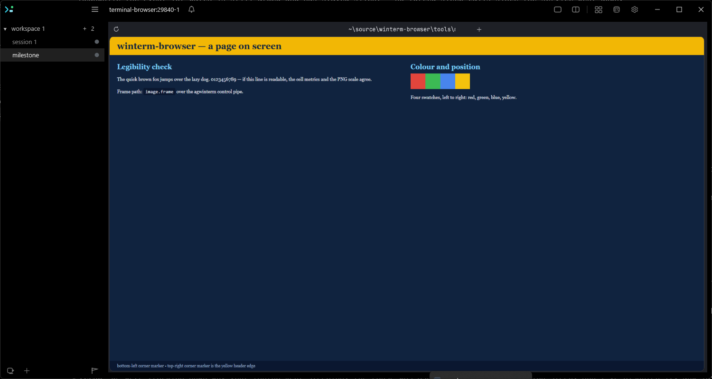

<div align="center">

# agwinterm-browser

**A real Chromium browser rendered inside a Windows terminal pane.**

A Windows-native port of [zenbu-labs/terminal-browser](https://github.com/zenbu-labs/terminal-browser),
hosted by [agwinterm](https://github.com/yeroo/agwinterm) rather than a
Kitty-graphics-over-stdout terminal. No WSL, no patched Electron.

[](https://github.com/yeroo/agwinterm-browser/actions/workflows/ci.yml)
[](https://scorecard.dev/viewer/?uri=github.com/yeroo/agwinterm-browser)
[](LICENSE)



</div>

---

Upstream is macOS/Linux only, for two independent reasons: its Rust engine does not compile on
Windows (41 errors, unconditional `termios`/`shm`/`UnixStream` use), and its transport — Kitty
graphics APC escapes written to stdout — is stripped by ConPTY before any Windows emulator sees it.
Both are covered in [`docs/design/00-port-brief.md`](docs/design/00-port-brief.md).

So the port **keeps** upstream's Electron browser, its React chrome and its `pixel-core` compositor
— 43 of `pixel-core`'s 46 source files use no unix API at all, and 40 of them ended up
byte-identical (the other three have a written reason, tabulated in
[`06-acceptance.md` §5](docs/design/06-acceptance.md#5-the-keep-unchanged-files) — two of them are
numbered divergences in [`UPSTREAM.md`](docs/design/UPSTREAM.md), and `lib.rs` is covered by that
file's preamble instead, since replacing its modules is what the port *is*), because taffy,
tiny-skia and fontdue are already
portable — and replaces the layer underneath: the tty module is split and its Windows half
rewritten, and frames leave over agwinterm's control pipe instead of through the terminal's own
output. In one line: **split one module, port one, drop one, keep forty-three.**

**WSL is out of scope.** This is a Windows-native port.

## Status

**It works.** A stock Electron 43.3.0 OSR browser, composited by `pixel-core`, drawn into an
agwinterm pane, with working keyboard and mouse — verified live and written up in
[`docs/design/06-acceptance.md`](docs/design/06-acceptance.md). 523 Rust tests and 570 node tests
pass on Windows — the two node cases that need a host with `image.frameshm` skip on a release —
including the 203 inherited tests in the files this port did not touch.

Two things are knowingly short of upstream, both because of a host gap rather than this tree:
the pointer resolves to one character cell, and on every agwinterm release as of 2026-09 cell
pixel metrics have to be set by hand for a sharp picture. Both are
[documented ceilings](docs/design/07-as-built.md#3-the-accepted-ceilings) with a named fix on the
agwinterm side; the second's, `session.metrics`, is on agwinterm `main` at `8230d0e` beside
`image.frameshm`, and the browser already asks for it. One planned feature shipped later than the port: the
`image.frameshm` fast path, adopted in 2026-09 once agwinterm published its contract. On a host
that has the verb — agwinterm built from `main` at `8230d0e` or later; no release as of
2026-09-04 — frames go over shared memory at about **114 fps** at a 131×37 pane. On any other
host, and on agliteterm always, they go out as PNG at about **25 fps**: enough for a page, not
enough for smooth scrolling.

## Requirements

| | |
|---|---|
| Windows | 10/11, with [agwinterm](https://github.com/yeroo/agwinterm) running — there is no other host |
| Node | 22.x |
| pnpm | 10.13.1, via `corepack` (bundled with Node) |
| Rust | 1.93.1 — pinned by `engine/rust-toolchain.toml`, with the MSVC toolchain |
| `cargo-nextest` | only for the test command below: `cargo install --locked cargo-nextest`. Not part of the pinned toolchain. |
| Python | 3.x, only for the two vendor-scope lint checks below |

`engine/justfile` is upstream's recipe set and installs its tools with `brew`; it is not the
Windows entry point. The commands in this file are.

The browser draws into an agwinterm pane over its control pipe and nothing else. Run outside one
and the CLI says so rather than starting a browser you cannot see.

## Install

```powershell
corepack pnpm install      # also fetches stock Electron 43.3.0 — no fork, no patch
corepack pnpm -r build     # builds pixel_node.dll -> native/pixel.node, then the TypeScript
```

Use `corepack pnpm -r build` rather than `corepack pnpm build`: the root `build` script shells out
to a bare `pnpm`, which is not on `PATH` unless you have run `corepack enable`.

`pnpm install` alone is expected to leave `browser/node_modules/electron/dist/electron.exe` in
place. If it does not, that is the failure to chase — everything downstream depends on it.

## Usage

From inside an agwinterm pane:

```powershell
node cli\dist\main.js https://example.com
node cli\dist\main.js open https://example.com   # the same thing, spelled out
node cli\dist\main.js ls                         # running browsers and their tabs
node cli\dist\main.js pane-clear                 # repair a pane a dead browser left unusable
node cli\dist\main.js --help
```

The browser runs **in the foreground of the pane it was started from**, holding that pane's console
for as long as it lives, and its exit code is the command's exit code. That is not a style choice:
Windows has no path that names another process's ConPTY, and no process can hold two consoles, so
upstream's daemon cannot serve N panes here at all. The reasoning and the measurements are in
[`docs/design/03-process-model.md`](docs/design/03-process-model.md).

**Ctrl is the accelerator** — Ctrl+T, Ctrl+L, Ctrl+R, Ctrl+C to copy, Ctrl+Q to quit. There is no
Super key to bind, because agwinterm implements no kitty keyboard protocol. Ctrl+Shift+C is left to
the terminal. **Zoom is Alt+`=` / Alt+`-` / Alt+`0`, and back and forward are Alt+Left /
Alt+Right**: a Windows console encodes Ctrl only with a letter, so Ctrl+`=` reaches the browser as a
bare `=` and Ctrl+`[` as Escape. Alt is accepted for those two and nowhere else.

The same encoding carries no Shift with a Ctrl chord — `ctrl+shift+f` and `ctrl+f` arrive as the
same byte — so the Ctrl+Shift defaults are spelled differently here: **find is Ctrl+F, devtools is
F12, record is Alt+R, and Alt+Enter finishes a recording**.

### Recovering a pane

```powershell
node cli\dist\main.js pane-clear
```

Run it **in the pane that is wrong**. A browser that exits normally cleans up after itself. One
that is force-killed, crashes, or has its pane closed out from under it runs no cleanup at all,
and leaves two separate things behind:

- **the frame.** A picture is a *placement* — agwinterm holds the last frame, a PNG it read or
  the pixels it copied out of the mapping, until something replaces it — so the final page stays
  painted over the shell running underneath. The pane is a working terminal you cannot read.
- **the console.** The alternate screen buffer, a hidden cursor, and mouse reporting, all left on.
  The shell comes back cursorless and echoless, and every pointer move over the pane types
  `\x1b[<555;39;9M` at the prompt.

`pane-clear` undoes both. It needs no browser running and no instance in the registry — that is
its whole purpose, since it runs when things are already broken — and it **prints what it found**,
so "it worked" and "there was nothing wrong here" do not look identical on a pane that was already
fine. It will not take down a picture this browser never drew: with no frame directory of ours on
disk it reports that the placement is someone else's and leaves it alone, restoring the console
either way. Having cleared one, it deletes every directory that proved it — a pane holds one
placement, so a pane wrecked twice is repaired by one clear and both wrecks are spent — and a second
run reports an already-repaired pane as the nothing-to-do it is.

Two cases it deliberately leaves painted, both reported rather than silent: a pane holding a
placement no frame directory of ours accounts for, and a pane whose instance
[`TERMINAL_BROWSER_ALLOW_PIPE`](#working-on-the-browser) does not list. The console is restored
either way.

Killing the **CLI** rather than the browser is the case it exists for. On Windows a child spawned
without `detached` sits in a job object that dies with its parent, so one `taskkill /F` on the CLI
takes down both halves of the automatic cleanup at once — the browser's destructor never runs, and
neither does the CLI's clear on the way out.

### Getting a sharp picture

No agwinterm release publishes its cell size yet — `session.metrics` is on `main` at `8230d0e`,
and the browser asks for it before falling back — so on a release the engine falls back to 16×32 px
per cell and agwinterm resamples the result. Tell it the truth and text sharpens, the page's
viewport stops being ~1.8× too large, and the frame gets **2.5× cheaper**:

```powershell
$env:TERMINAL_BROWSER_CELL_PX = "10x20"   # your font's cell, in device pixels
```

### The knobs

| variable | what it does |
|---|---|
| `TERMINAL_BROWSER_CELL_PX` | `<width>x<height>` in device pixels. Consulted before the host, so it also corrects a host that answers wrongly. |
| `TERMINAL_BROWSER_FRAME_TRANSPORT` | `auto` (default), `file`, or `shm`. `auto` takes the shared-memory path on a host that answers `image.frameshm` and the file path otherwise; `file` forces the file path, which is what keeps the baseline measurable; `shm` asks for the fast path and says once, as a warning, if the host cannot carry it. See [the transports](docs/design/07-as-built.md#1-the-two-frame-transports). |
| `TERMINAL_BROWSER_FRAME_BUDGET` | a path to append one tab-separated line per frame: `seq, canvas, span, bytes, encode_ms, write_ms, publish_ms, transport, copy_ms`, where `transport` is `file` or `shm` and the stages a transport does not pay are `0.00`. This is what [the frame budget](docs/design/02-frame-budget.md) was measured with. |
| `TERMINAL_BROWSER_ALLOW_PIPE` | the agwinterm instances this build may address: a comma- or semicolon-separated list of pipe names, or `*`. Unset means no guard — and unset is what you want unless you are developing the browser. Set, it stops the **CLI** launching into an instance it does not name, in every build, and stops a **debug** engine drawing into one. See [Working on the browser](#working-on-the-browser). |

The engine's warnings and errors — the `shm` explanation among them — are appended under the CLI to
`%LOCALAPPDATA%\<app>\logs\stderr.log` as `engine <level> <target>: …` lines
(`browser/src/engine-log.ts`). Only under the CLI: a browser started by hand with fd 2 on the
console gets none, so a line cannot paint over the placement.

### Working on the browser

Everything above is how you *use* it. This is the one rule for developing it, and it exists because
breaking it is silent: a pane's `AGWINTERM_PIPE` names whichever agwinterm that pane belongs to, and
with the variable unset it is `agwinterm` — the instance you are reading this in. A browser launched
from your own terminal publishes into your own terminal, and a frame is a *placement* agwinterm holds
until something replaces it, so a crash or a `taskkill /F` leaves the page painted over your shell
with mouse reporting still on. That happened, and the pane stayed that way for eighteen hours.

```powershell
# 1. a Debug agwinterm of your own, on its own pipe and data dir (built from
#    agwinterm's own tree, src/Agwinterm.Win32)
<agwinterm-debug-build> --app-id agwinterm-dev

# 2. confirm you are talking to it and not to the real one — a fresh tree, not your sessions
agwintermctl --pipe agwinterm-dev tree

# 3. open a pane on it, and run the browser from inside that pane
agwintermctl --pipe agwinterm-dev session new --command "powershell"

# 4. in that pane, name the instance you meant. A debug build refuses every other one.
$env:TERMINAL_BROWSER_ALLOW_PIPE = "agwinterm-dev"
node cli\dist\main.js https://example.com
```

Step 4 is the guard, and it is opt-in for a reason: on Windows the shipped product *is* a checkout —
`pnpm -r build` runs `cargo build -p pixel-node` with no `--release` — so a guard that refused an
unlisted instance by default would refuse every ordinary run. Setting the variable arms it.
`tools/milestone/run-milestone.cmd` defaults it to `agwinterm-dev` on your behalf.

**Unset it when you are done.** The two halves read the variable differently and only one of them
has a build to consult. The engine's copy is `debug_assertions`-only, so a `--release` engine ignores
it; the CLI's cannot be — `tsc` emits the same JavaScript either way — so `terminal-browser open`
honours it in every build and *refuses to launch* into an instance the list does not name. Since the
shipped Windows build is that same unoptimised checkout, a stale value in a shell profile would have
stopped the browser drawing regardless; refusing up front, with a message naming the variable and the
way out, is the visible version of that. `pane-clear` withholds its `image.clear` for the same reason
and says so.

If a pane does end up wrecked anyway, [`pane-clear`](#recovering-a-pane) in that pane is the
recovery — with one caveat, below: it will not clear a pane belonging to an instance the guard
excludes, which is the pane a dev-instance guard makes most likely to be wrecked. Unset the variable
(or set it to `*`) for that one command.

### What this port refuses

`--ssh`, `upgrade`, `--split` and `shutdown` are refused on Windows, each naming its own obstacle,
and `setup`'s AppArmor step now says out loud that there is nothing to install. `open` refuses two
more from the pane's own environment: an `AGWINTERM_PIPE` that is not a pipe name, and — when
[`TERMINAL_BROWSER_ALLOW_PIPE`](#working-on-the-browser) is set — an instance it does not list. None of them is a
platform check standing in for a reason — the reasons are in
[`docs/design/07-as-built.md`](docs/design/07-as-built.md#dropped-or-refused-in-the-cli).

## How a frame reaches the pane

Not through the terminal's output stream, which is the whole reason this is a port:

```
Electron OSR paint(BGRA)  ->  pixel-core composites  ->  RGBA into a slot of Local\agwinterm-frame-browser-<pid>-<n>
    ->  {"cmd":"image.frameshm", ...}  over agwinterm's control pipe  ->  placed at the pane's origin

                                                   ->  PNG to a fresh path under %TEMP%       (host without the verb)
    ->  {"cmd":"image.frame", ...}  over agwinterm's control pipe  ->  placed at the pane's origin
```

The upper route needs an agwinterm that implements `image.frameshm` (`main` from `8230d0e`;
no release as of 2026-09-04). The first frame asks; a host that answers `unknown command` gets
the lower route for the rest of the session, and that first frame is re-sent down it rather
than dropped.

Input goes the other way and needs no side channel: it arrives *through* the pty as ordinary VT
sequences, decoded by the 659-line decoder inherited from upstream's `terminal.rs`. Hold onto that
asymmetry when reading the backend — it is also why the daemon architecture breaks on input only.

## Tests

```powershell
corepack pnpm test                 # node --test over tools/*/*.test.mjs
cd engine; cargo nextest run --workspace
cd engine; cargo test --workspace  # not redundant: one process, so it can see races nextest cannot
python tools/vendor-check/fmt-scope.py
python tools/vendor-check/clippy-scope.py
```

`tools/acceptance/frameshm.test.mjs` is the one suite that talks to a live host. Run from an
agwinterm pane, it opens sessions on *that* instance (`session.new`, never the pane it runs in),
runs the built browser in each, and closes them. On a release host it runs only the fallback case
and skips the two fast-path cases; a pane of an instance built from agwinterm `main` at `8230d0e`
or later (`--app-id agwinterm-dev`) runs those too. With no host — CI — it skips entirely, and a
launch that fails keeps its scratch directory and names it in the message.

`tools/vendor-check/` is the suite that keeps this port honest about upstream. It takes its
scope from the vendoring commit rather than from a checked-in list: the 239 paths `45b5e43`
introduced, minus four declared exclusions, diffed against that commit on every run. So all
three vendored trees are covered — `pixel-core`, `pixel-node` and `pixel-react` — along with
`browser/`, `cli/`, `store/`, `terminals/` and the manifests, with nobody to remind. A file
vendored *later* is a different question: the universe is one commit's contents, so what covers
it is the untracked check below, and the answer to that is a re-vendor that moves the baseline.
A path that differs must be the port's own subject matter,
a numbered divergence in [`UPSTREAM.md`](docs/design/UPSTREAM.md), or a declared exclusion;
anything else fails by name. Three failures a diff cannot show are checked separately: a
vendored file that was **deleted**, an **untracked** file sitting inside a vendored tree, and
a `native/pixel.node` that is missing or **older than its source**. Until 2026-08-26 the guard
covered `pixel-core/src` and nothing else — see
[`07-as-built.md`](docs/design/07-as-built.md#the-guard-that-covered-one-tree-of-three).

The two `*-scope.py` scripts run `cargo fmt --check` and `cargo clippy` for real and then
`git blame` every complaint against the vendoring commit. The vendored tree does not pass either
check and reformatting it would be exactly the silent edit this project forbids — so the checks
apply to lines this port wrote, and that scope is enforced rather than asserted.

## Documentation

| | |
|---|---|
| [`00-port-brief.md`](docs/design/00-port-brief.md) | why a port and not a build flag; the architecture, and what the implementation later corrected |
| [`01-baseline-errors.md`](docs/design/01-baseline-errors.md) | the 41 compile errors, and the full-tree disposition pass |
| [`02-frame-budget.md`](docs/design/02-frame-budget.md) | what a frame costs, measured per stage, and how to re-measure |
| [`03-process-model.md`](docs/design/03-process-model.md) | why the engine runs in the foreground process, measured with real consoles |
| [`04-cell-metrics.md`](docs/design/04-cell-metrics.md) | where a cell's pixel size comes from, and the verb that would settle it |
| [`05-cli-and-endpoints.md`](docs/design/05-cli-and-endpoints.md) | two control protocols on named pipes, `%LOCALAPPDATA%`, and the commands Windows cannot honour |
| [`06-acceptance.md`](docs/design/06-acceptance.md) | every acceptance criterion, how it was checked, and the two defects it found |
| [`07-as-built.md`](docs/design/07-as-built.md) | the two frame transports, what was dropped, and the accepted ceilings |
| [`UPSTREAM.md`](docs/design/UPSTREAM.md) | what was vendored, every deliberate divergence, and the re-vendoring checklist |

The plans are [`20260821-windows-port.md`](docs/plans/completed/20260821-windows-port.md), the port itself,
[`20260822-post-port-corrections.md`](docs/plans/completed/20260822-post-port-corrections.md), which fixed
four defects the port shipped with — and ran the review it shipped without,
[`20260826-vendor-check-gap.md`](docs/plans/completed/20260826-vendor-check-gap.md), which
widened the vendored-tree guard from one tree to three, and
[`20260826-deferred-browser-defects.md`](docs/plans/completed/20260826-deferred-browser-defects.md), which
closed the two Windows profile defects that plan deferred.

## How this project is built

| role | tool |
|---|---|
| planning + implementation | [ralphex](https://github.com/umputun/ralphex) — plans in `docs/plans/`, executed autonomously |
| review | [revmux](https://github.com/umputun/revmux) — every plan and every diff, before acceptance |

`.revmux/` is committed: the lenses, profiles and severity bar are this project's versioned review
standard, not one maintainer's habits. Note that a checked-in lens is executed by a headless agent
with a shell — read it like you would read a `Makefile`.

## Licence

Upstream's, unchanged — see [`LICENSE`](LICENSE).
