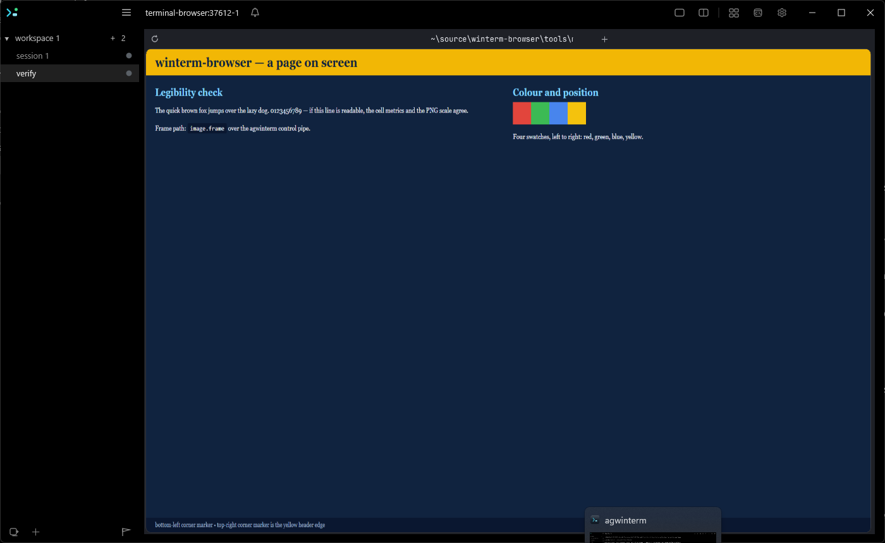
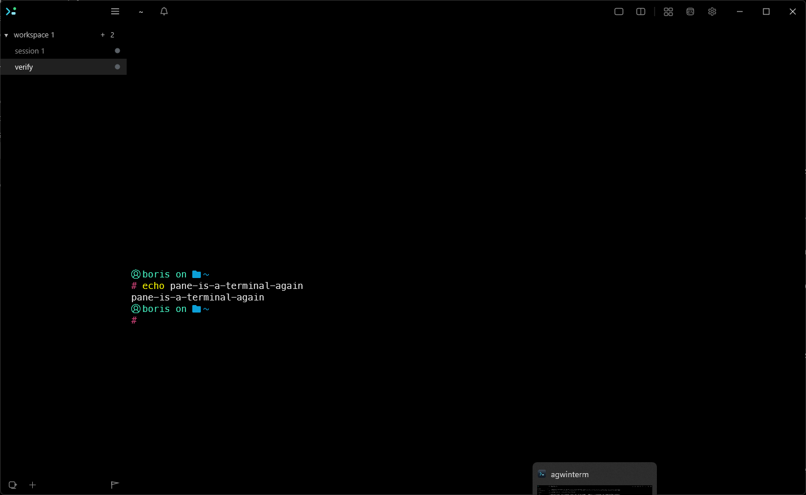
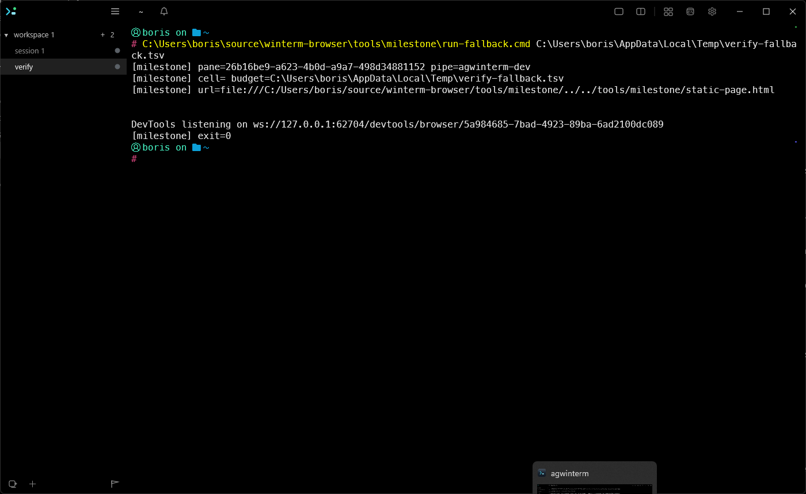

# Acceptance — what was checked, how, and what it found

Task 14 of [the port plan](../plans/completed/20260821-windows-port.md). Every criterion below
was run rather than reasoned about, on this machine, on 2026-08-21. Two of them
failed the first time and the fixes are recorded with them; a criterion that passed
only after a change is not a criterion that passed.

The live checks ran against a **Debug agwinterm on its own pipe** (`--app-id
agwinterm-dev`), built from `src/Agwinterm.Win32` and stopped afterwards. The
Constraints forbid testing against the real instance, and every check recorded below
was driven through a pane of the Debug one — created with `agwintermctl --pipe
agwinterm-dev session new` and typed into with `session.type`.

**That is a claim about the checks below, and it was written as a claim about the
run.** It is not one. The morning after, a pane of the *real* instance was found
holding a stale browser frame with SGR mouse reports streaming into its shell prompt,
about eighteen hours after the run ended — so some run during the port did publish
into the real instance, and it is not any of the ones recorded here.

What the state itself narrows it to: mouse reporting is turned on by `ModeGuard`
against the console the engine *attached* to, and the frame was placed on that same
pane, so the engine ran with the real pane's console and inherited its `AGWINTERM_*`
— that is, it was launched from the run's own shell rather than from a pane of the
Debug instance. Nothing else in the port has that shape. The best-supported candidate
in the run log is Task 10's ad-hoc probing between 18:20 and 18:38 on 2026-08-21
("Probe electron env and cell override", "Re-run with correct cell metrics override"),
which ran `electron.exe` through `cmd /c set …` rather than through the dev pane and
ended at "Kill electron and rebuild native" — a force-kill runs no `Drop`, which is
exactly a frame left placed and the reporting modes left on. The log records the
invocation but not its environment, so that last step is a reconstruction; the part
that is not is that a run outside the dev instance happened at all.

The correction is the guard, not the sentence: `TERMINAL_BROWSER_ALLOW_PIPE` (the
corrections plan's Task 2) makes a debug build refuse an instance it was not named
at, so "which pane did that go to" stops depending on remembering. The dev workflow
it belongs to is in [the README](../../README.md#working-on-the-browser).

---

## 1. Every Overview requirement is implemented

| requirement | where it lives | evidence |
|---|---|---|
| a real Chromium browser | stock Electron 43.3.0, OSR | `browser/node_modules/electron/dist/electron.exe`, 348 MB, registry-sourced |
| rendered inside a terminal pane | `frame_file.rs` → `image.frame` → agwinterm | the captures below |
| working keyboard | `terminal_windows.rs` read loop + the inherited decoder | Task 11; Ctrl+Q quits the browser in §4 |
| working mouse | SGR reports through the same decoder | Task 11, at cell resolution (accepted ceiling) |
| stock Electron | no fork, no patch | §2 |
| no WSL | — | §2 |
| split one module | `terminal.rs` → `terminal_types.rs` + the gated tty half + the decoder | Tasks 3–4 |
| port one | `terminal_windows.rs` | Task 5 |
| drop one | `ghostty.rs`, `#[cfg(unix)]` in `lib.rs` | §5 — the file itself is byte-identical |
| keep forty-three | — | §5, and it is now forty and three explained |

The two ceilings the Overview accepts are still ceilings and are still documented:
cell-resolution pointing ([`04-cell-metrics.md`](04-cell-metrics.md)) and unpublished
cell metrics, with `TERMINAL_BROWSER_CELL_PX` as the explicit override.

## 2. No WSL, no patched Electron

- `grep -rniI wsl` over the tree hits documentation only — the brief, the plan, the
  README and this project's own progress log, every one of them saying it is out of
  scope. No script, config or code path.
- `browser/package.json` has **no fork fetch**. Its `postinstall` is
  `node node_modules/electron/install.js` — the stock installer, run explicitly
  because Electron 43 dropped its own build script and would otherwise download
  lazily on first `require`. Divergence 1 in [`UPSTREAM.md`](UPSTREAM.md).
- `pnpm-lock.yaml` resolves `electron@43.3.0` by npm-registry integrity hash. There
  is **no `tarball:` resolution, no non-registry URL, and no `overrides`/`resolutions`
  block** anywhere in the lockfile or the workspace manifests — the three ways a fork
  mirror could enter.
- The installed binary reports `43.3.0` in `dist/version` and `electron/electron` as
  its repository.

## 3. The file-based path carries a frame when the fast one is asked for

Run: `TERMINAL_BROWSER_FRAME_TRANSPORT=shm`, which names `image.frameshm` — a verb
this build did not yet produce, and agwinterm did not answer, when this was accepted
(2026-08). The frame must go out anyway, over `image.frame`, and the reason must be
said once rather than per frame.

`tools/milestone/run-fallback.cmd` in a dev pane, with a frame-budget TSV:

```
# seq  canvas      span    bytes     encode_ms  write_ms  publish_ms
0      1920x1280   120x40  2765237   20.21      0.99      10.00
1      1920x1280   120x40  9832498   34.50      3.20      11.51
...
```

Eleven rows. `publish_ms` **is** the `image.frame` round trip, so a row is a frame
that went out over the file path. On screen:



Pinned by `frame_file.rs`'s `asking_for_a_fast_path_the_host_lacks_still_publishes_over_the_file_one`
and `the_unavailable_fast_path_is_said_once_and_not_per_frame`.

➕ *2026-09:* the build now produces the verb (plan `20260903-adopt-image-frameshm.md`),
so this criterion reads "a host that answers `unknown command`" — every agwinterm
release as of 2026-09, and agliteterm always — and the budget file has grown a
`transport` and a `copy_ms` column after the seven shown. It is re-accepted against a
release host by `tools/acceptance/frameshm.test.mjs`, which also reads the once-said
reason out of the CLI's `stderr.log`.

➕ **A test-isolation bug surfaced here.** The transport tests share one process-wide
log store behind a mutex, but the mutex was taken only by the tests that *read* it —
and the test that publishes under `shm` *writes* it. Under `cargo test`'s threads its
line landed inside another test's window, failing "the path that exists is never
apologised for" about a warning it never emitted. `cargo nextest` gives each test its
own process and cannot see this class of bug at all; `cargo test` can, which is why
both are run.

## 4. A killed browser leaves the pane usable as a terminal

**This one failed, and the failure was invisible to every check but the eye.**

Force-killing the browser left the shell running and answering — `session.text`
returned its prompt, and typing `echo` into the pane produced output. And none of it
could be read, because the last frame was still on screen over it.

A frame is a **placement**: agwinterm holds the last PNG until something replaces it.
That is the property Task 10 relied on (switching sessions and back costs no repaint)
and it is exactly what makes an exiting browser a problem. Nothing in the port ever
sent `image.clear`.

Fixed in the two places that can, because neither covers the other:

- **`Terminal::drop`** (`terminal_windows.rs`) → `FramePublisher::clear`. Covers an
  ordinary quit and an unwind. A publisher that never published sends nothing — that
  placement belongs to whoever *did* draw it.
- **`clearOwnedPaneFrame`** (`cli/src/pane.ts`), after `openInForeground`'s wait. Covers
  the exits that run no destructor: `taskkill /F`, a crash, a kill from another pane.
  The CLI is the pane's foreground job, so it outlives the browser whenever the browser
  is what died. Best-effort and unable to change the exit code: every failure means the
  placement is gone anyway.

⚠️ **"Whenever the browser is what died" was written as "by construction", and that
was the gap.** Kill the CLI instead and it takes the browser with it, so neither of the
two runs — see the re-check below, and the third path it produced.

Its addressing repeats `HostTarget::from_env`'s rules deliberately — `AGWINTERM_ENABLED`,
session-then-pane id, `"active"` refused, the default pipe name — because the engine
places the frame and the CLI takes it back, and a disagreement would not error, it
would clear someone else's pane.

Both paths verified live:

| | |
|---|---|
|  | `taskkill /F` on the browser started by `terminal-browser open`. The picture is gone and the shell echoes. |
|  | Ctrl+Q, with no CLI in the chain — so this is `Drop` doing it. `[milestone] exit=0` and the scrollback is readable. |

Tests: the ownership rule in `frame_file.rs` — the verb goes out last; a publisher
that never drew clears nothing; one whose first frame was *refused*, or that the host
answered `frame:0/0` for, clears nothing either; a refused clear is still an exit; a
frame nobody placed names no pane — and the whole of `tools/cli/pane-clear.test.mjs`,
driving a real `net.Server` on a real named pipe. The counts live in §6's coverage
table and nowhere else: a second copy here is a second thing to go stale, which is
exactly what happened to the first one.

➕ **Re-checked, harder, on 2026-08-24 — and the first check had the wrong half.**
Force-killing the *browser* is the mild case: the CLI is still there and clears the
frame on its way out. Killing the **CLI** is the one nothing covered, and on Windows it
is not a variant of the other — libuv puts a child spawned without `detached` into a job
object that terminates with its parent, which is exactly how `openInForeground` spawns
("this process is the pane's foreground job"). So one `taskkill /F` on the CLI takes
down *both* cleanup halves at once: `ModeGuard::drop` never runs in the browser and the
CLI's clear never runs either. Measured rather than reasoned about, and it is the
strongest argument for the `pane-clear` verb existing
([the corrections plan](../plans/completed/20260822-post-port-corrections.md), Tasks 1 and 6).
Both cases are now processes rather than eyes: `tools/acceptance/pane-clear.test.mjs`
spawns `node cli/dist/main.js pane-clear` against a real named pipe, with a browser that
is a real process planting a real frame directory and then ended with `taskkill /F`, and
reads what came back.

The other correction the verb forced is upstream of it. `openInForeground` sent
`image.clear` on **every** exit path with no test for whether this browser had ever
drawn — the CLI contradicting the engine's own rule that a publisher which never
published has nothing to take back, because "asking anyway would clear a placement some
*other* process owns" (`frame_file.rs`). A browser that died before its first frame
would have taken down whatever the pane was showing beforehand. It asks now, by pid.

## 5. The keep-unchanged files

Of `pixel-core`'s **46** vendored source files, **4 differ** from the vendoring
commit (`45b5e43`):

| file | why |
|---|---|
| `terminal.rs` | one of the three replaceable modules — the port *is* this diff |
| `lib.rs` | module declarations: six new modules, two `#[cfg(unix)]` gates, one re-export |
| `clipboard_image.rs` | divergence 4 — POSIX path assumptions widened behind `cfg!(windows)`, and UNC narrowed |
| `engine/mod.rs` | divergence 6 — one added `#[test]`, no production line touched |

So of the 43 the plan calls keep-unchanged, **40 are byte-identical** and three have
a written reason. `ghostty.rs` and `herdr.rs` are byte-identical too: "drop one" is a
`#[cfg(unix)]` in `lib.rs`, so both still compile and still run their tests on unix.

⚠️ The plan expected **one** diff here (the Task 3 re-export shim). Task 4 predicted
the list would grow and said why: `inventory.test.mjs` screens for unix *APIs*, and
`clipboard_image.rs` had none while assuming unix *paths* in four places. **"No unix
API" is not "portable."** The two other path-handling files in the 43 —
`image_cache.rs` and `native.rs` — pass their tests today, and that is the only
evidence there is about them.

Now checked by `tools/vendor-check/unchanged.test.mjs`, which fails if the set moves
in either direction and cross-checks that every entry has an `UPSTREAM.md` section.

## 6. Tests, lints and coverage

Re-run on **2026-09-04**, after the `image.frameshm` plan (`20260903-adopt-image-frameshm.md`)
and its review round; the run before it was
[the deferred-browser-defects plan](../plans/completed/20260826-deferred-browser-defects.md)'s on
2026-08-26, whose rows were 467 / 410+57 / 551 over 125 suites, and before that
[the vendor-check-gap plan](../plans/completed/20260826-vendor-check-gap.md)'s, whose node row was
510 / 112 suites. The numbers this table carried on 2026-08-21 were 421 / 364+57 / 266 and on
2026-08-25 the node row was 389 / 90 suites, and leaving any of them would have made the table
a claim about a tree that no longer exists.

| check | result |
|---|---|
| `cargo nextest run --workspace` | **523 passed**, 1 skipped (`bench_encode`, a manual benchmark) |
| `cargo test --workspace` | 466 + 57 passed — run *as well*, because it shares one process and can see races nextest cannot |
| `node --test "tools/*/*.test.mjs"` | **570 passed**, 130 suites, **2 skipped** (the two `frameshm` cases that need a host with the verb; this was a release host), 29.5 s wall clock |
| inherited `pixel-core` tests | the 203 measured at Task 4 are still green, on Windows |
| `cargo clippy --workspace --all-targets` | 12 warnings, **0 on a line this port wrote** |
| `cargo fmt --all --check` | 297 complaints, **0 on a line this port wrote** |

The two lint rows are the scoped scripts below rather than the bare commands, and that
is not a softening: the bare commands cannot be green in this tree and never could —
297 rustfmt complaints and 12 clippy warnings are the *vendored* tree's, and
reformatting it is the silent edit the Constraints forbid. The two scripts under
`tools/vendor-check/` run the real check and `git blame` every complaint.
And a suite that cannot hang is now part of what "passed" means: `--test-timeout` plus
the shared waits in `tools/lib/deadline.mjs` (corrections plan, Task 3).

### The two probe crates are not in this table, on purpose

`tools/conpty-probe` and `tools/console-inherit-probe` are standalone cargo packages
with their own lockfiles, absent from `engine/Cargo.toml`'s workspace members — so
`cargo test --workspace` does not reach their 278 lines of tests, and nothing in CI
does either.

That is deliberate rather than an oversight, but it has a cost worth stating. They
are **one-shot measurements**, not regression tests: they answered "does a ConPTY
child read SGR mouse reports" (Task 1) and "does a GUI-subsystem child inherit its
parent's console" (Task 3), and those answers are what the process model and
`ENABLE_REPORTING` were built on. Adding them to the workspace would mean every
`cargo test` spawning real pseudoconsoles and real child processes, which is slow and
flaky in a way unit tests should not be.

The cost is that a Windows or toolchain change invalidating either measurement is
invisible here. What stands in for them is narrower and cheap: `tools/process-model/
entry.test.mjs` pins `electron.exe`'s PE subsystem, which is the property the
inheritance measurement turns on. Run the probes by hand
(`cd tools/console-inherit-probe && cargo test`) when that pin fails, or when the
foreground shape stops working on a new Windows build.

### Why the two lint checks are scoped, and how the scope is enforced

The vendored tree does not pass either check and never did —
[`01-baseline-errors.md`](01-baseline-errors.md) measured 172 rustfmt hunks at the
baseline, most of them inside the 43. Reformatting them is precisely the silent edit
the Constraints forbid, and it would destroy §5's diff. So the disposition recorded
at Task 1 stands: **these checks apply to code this port writes.**

That is a weaker claim only if it is unenforceable, so it is enforced.
`tools/vendor-check/fmt-scope.py` and `clippy-scope.py` run the real check and
`git blame` every complaint: a complaint on a line written after `45b5e43` fails the
script. Both report zero. rustfmt names the first line of its context rather than the
line it objects to, so the fmt script blames the *removed* lines instead — otherwise a
vendored misformat gets charged to whichever commit added a module declaration near
it, which is how two false positives and two real ones were told apart.

The two real ones were fixed: a stray blank line in `terminal_backend.rs` and another
in the port's `read_exact_at` shim in `capture.rs`.

### Coverage

The project standard is the plan's own: *every task carries new or updated tests, as
separate checklist items, covering success and error scenarios.* There is no coverage
percentage in this repo and inventing one at the last task would be a number rather
than a standard. What is checkable is that every module the port added is tested, and
every one is:

| module | `#[test]`s | | suite | `test()`s |
|---|---|---|---|---|
| `terminal_windows.rs` | 59 | | `cli/pane-clear.test.mjs` | 88 |
| `agwinterm.rs` | 50 | | `vendor-check/inventory.test.mjs` | 37 |
| `frame_file.rs` | 43 | | `vendor-check/universe.test.mjs` | 36 |
| `frame_shm.rs` | 10 | | `cli/endpoint.test.mjs` | 33 |
| `terminal_backend.rs` | 9 | | `vendor-check/unchanged.test.mjs` | 33 |
| `terminal_types.rs` | 5 | | `cli/unsupported.test.mjs` | 31 |
| | | | `vendor-check/dispositions.test.mjs` | 30 |
| | | | `launcher/launch.test.mjs` | 28 |
| | | | `input/page-input.test.mjs` | 23 |
| | | | `offscreen/present.test.mjs` | 18 |
| | | | `vendor-check/native-build.test.mjs` | 18 |
| | | | `vendor-check/upstream-doc.test.mjs` | 15 |
| | | | the rest | 161 |

Re-counted on **2026-08-26**; the node column sums to the 551 of that day's run. The
2026-09-04 run's new suites are `browser/engine-log.test.mjs` (8) and
`acceptance/frameshm.test.mjs` (4, two of them skipped on a release host), plus one
case in `docs-check/docs`; the breakdown above was not redone. Most of the
growth in the table's "the rest" is three suites that did not exist at the previous
count, all from the deferred-browser-defects plan: `browser/foreground.test.mjs` (14),
`browser/profile.test.mjs` (12) and `acceptance/profile-lock.test.mjs` (5). The other
ten cases are additions to suites that were already there — `acceptance/pane-clear`
(+2), `docs-check/docs` (+3), `cli/store` (+1) and `lib/deadline` (+4, the review round
that noticed `settlesWithin` was the only bound on five waits and had no test of its own,
plus the case pinning that its poll interval cannot outlive its deadline).
`vendor-check/` is now seven files rather than four: the vendor-check-gap plan derived the scope from
the vendoring commit, gave every diverged path a disposition, and parsed `UPSTREAM.md`
against the table that cites it. `native-build.test.mjs`'s three artifact tests are in
that 18 because they no longer skip — an unbuilt or stale `pixel.node` is a failure now
rather than a silent pass, which is why the run above records **0 skipped**. Stale is
measured against `engine/crates` plus every build input outside it: the manifest and the
lockfile decide the dependency versions, `windows-sys` features and opt-levels the
artifact is compiled with, `rust-toolchain.toml` decides the compiler, the two fonts are
`include_bytes!`d into the binary, and `build-native.mjs` decides which profile is
copied — none of them under the source root. That last list is hand-written, so the
suite derives the embedded-asset half from the crate sources and fails if an
`include_bytes!` appears that no compared path covers.

The three biggest movers since 2026-08-21 are the corrections plan's: `pane-clear.test.mjs` (13 → 84),
`agwinterm.rs` (29 → 49, the exchange deadline) and `terminal_windows.rs` (38 → 54).
The plan and the first review round after it took them to 60, 46 and 53, and the last
five of each are that round's: the frame roots the engine could have chosen, a pid the
caller asked about and does not have, the evidence consumed with the placement it
authorised, and the two ends of the `u32` a Win32 wait must never be given. The eight
rounds below carry them the rest of the way.

A second review round moved seven more, and all seven are about the same seam — which
of two panes a wreck on disk belongs to. `frame_file.rs` (32 → 36) gained the pane
marker the engine now writes beside the first frame a host accepts, and the rule that a
*failed* clear leaves its directory standing for the CLI to find; `pane-clear.test.mjs`
(60 → 63) gained the host that answers `ok:false` — bytes on the pipe that are not a
repair — and the wreck belonging to the pane next door.
Two suites in the table did not exist then — `tools/lib/deadline.test.mjs` and
`tools/acceptance/pane-clear.test.mjs` — and are inside "the rest".

A third round moved one more, and it is about what the recovery verb *says*.
`restorePaneConsole` returns both halves now rather than one boolean set from the write
alone, so `pane-clear` no longer reports a console "out of raw mode" on a run where
stdin was redirected and `SetConsoleMode` was never reached — the one wording that sends
a user away from a console that still does not echo. The same round raised the Win32
wait slack in `agwinterm.rs` from 2 ms to one system timer tick, which is what the
deadline test was actually losing to; it needed no new test, only the one it already had
passing forty times out of forty instead of thirty-eight.

A fourth round moved three, and both are about a guard that was asked too late.
`pane-clear.test.mjs` (64 → 66) gained the recycled pid: a directory named after the
process the CLI just spawned, whose `PANE_FILE` marker names a *different* pane, is no
longer adopted by the exit path — a pid is unique among live processes and nothing
more, and `sweep_stale` leaves a wreck standing for an hour — a week, once it names a
pane, so the evidence outlives the eighteen hours this verb was written for.
`terminal_windows.rs`
(53 → 54) gained the ordering the dev-instance guard needs: `Terminal::new` asks
`HostTarget::from_env` before `attach_console`, so a refused engine no longer takes the
pane's console, alternate screen and mouse reporting on the way to declining to publish.

A fifth round moved seven, and each is a claim that was true of a narrower case than
the code applied it to. `pane-clear.test.mjs` (66 → 69) gained the pane wrecked
twice — a successful clear now retires *every* directory it would have accepted, because
a pane holds one placement and the older wreck's was replaced long before the run, while
an older marker left standing reads as fresh ownership to the next run — and the two
halves of `clearOwnedPaneFrame` now read the same environment, so a caller that hands
one over is not told "nothing of ours to clear" over roots it never named.
`frame_file.rs` (37 → 39, and the table said 36 for a round) gained `frame:0/0`: an
`ok:true` reply that placed nothing is not a placement, so it neither marks the pane nor
enters `written`. `agwinterm.rs` (46 → 47) gained the peer that drips a byte and never a
newline — past the deadline `millis_until` hands out a fresh millisecond so an in-flight
read can still be cancelled, and `read_line` was going round for another one, so the
only remaining bound on an exchange was `MAX_REPLY_BYTES`. `tools/docs-check` gained the
slug: a heading slugger *stricter* than GitHub's agrees with a broken anchor instead of
failing on it, which is how `05-cli-and-endpoints.md`'s link to the
`TERMINAL_BROWSER_ALLOW_PIPE` section of `07-as-built.md` passed while landing at the
top of the file.

A sixth round moved five, and each is a claim the code makes that nothing was
watching. `pane-clear.test.mjs` (69 → 73) gained the three report branches no test
constructed — the guard refusing a pane that *does* hold a wreck, the same guard with
nothing found, and the escapes that failed while the input modes went back — and
`retire`'s fallback, reached by standing a working directory inside the wreck so
`fs.rmSync` says no: the directory stays, its claim on this pane does not. `frame_file.rs`
(39 → 40) gained the other end of `frame:0/0`, a reply this build cannot parse, which
counts as a placement precisely so a host that grows a field does not quietly cost the
publisher its frames. `agwinterm.rs` (47 → 48) gained `expired` itself, because the
write half of the loop bound has no fixture — a request never fills the pipe buffer —
and `tools/acceptance/pane-clear.test.mjs` gained the stray argument, which is the one
command line the verb does not exit 0 for. The same round scoped the frame roots to the
environment the caller handed over: `os.tmpdir()` answers for this process and no
other, so it is a root only when there is no other environment to answer for.

A seventh round moved one, and it is about a name compared two ways in one file. The
`TERMINAL_BROWSER_ALLOW_PIPE` allow-list matched its entry exactly while `sameMark`,
at the other end of the same module, folded the case of the same identifier and said
why: the object manager resolves a pipe name case-insensitively, so `Agwinterm-Dev` and
`agwinterm-dev` are one instance. All three readers now fold it — `pipeAllowed`
(`pane.ts`), `pipeRefusal` (`unsupported.ts`) and `allows_pipe` (`agwinterm.rs`) —
and `pane-clear.test.mjs` (73 → 74) pins the axis, with a `HOST_CASES` row and a Rust
case keeping the other two level. The guard failed closed, so what this fixes is a
developer refused from the instance they had put on the list, by a message naming a
value they could see was already there. The fold is **ASCII** in all three, which the
same round's review had to correct: the TypeScript copies reached for `toLowerCase`,
a Unicode fold no `eq_ignore_ascii_case` matches, and an entry spelling
`AGWINTERM-KIOSK` with a U+212A KELVIN SIGN would have cleared CLI preflight for the
engine to refuse a frame at a time later. All three now carry that row; no count
moved, because the axis was already pinned and only the fold under it changed.

An eighth round moved none, and all of it is about the same identifier compared by
readers that had to agree. `sameMark` was still the Unicode fold the seventh round
took out of the allow-list, and its operand is the one this module validates least —
`frameMark` reads the pipe name off a marker file in temp and trims it, where the
allow-list at least came from a variable the developer typed. It folds with
`asciiLower` now, so a marker spelling `AGWINTERM-KIOSK` with a U+212A KELVIN SIGN is
not read as this pane's: `FrameDir::mark_pane` only ever writes a `valid_pipe_name`,
so a marker that is not ASCII is one something else planted, and adopting it would
have been `pane-clear` deleting another tool's directory. The same round put the
padding on one definition too — `String.trim` and `str::trim` disagree about U+FEFF
and U+0085, so an entry an editor prefixed with a byte-order mark cleared the CLI and
was refused by the engine — and spelled the KELVIN SIGN as `\u{212a}` in the two
JavaScript fixtures, the way `agwinterm.rs` already spelled it, so the row and the
all-ASCII control beneath it stop rendering as two identical lines asserting opposite
results. No count moved: every case landed as an assertion inside a test that was
already there, or as a `HOST_CASES` row.

A ninth round moved two, and both are the half of the padding rule the eighth round
left untested. The union trim landed on every reader, but every fixture carrying a
U+FEFF or a U+0085 sat on the allow-list — so reverting either `nonempty` to its
language's own trim left the suite green, and the address is where the disagreement
actually costs a pane: a session id padded with a NEL had the CLI clearing
`"s1\u{85}"` while the engine drew on `"s1"`, and `sameMark` then declined the wreck
the engine's own marker named. `pane-clear.test.mjs` (74 → 75) and `agwinterm.rs`
(48 → 49) assert the *resolved* target, endpoint and window selector rather than a
request that is merely non-null, and a `HOST_CASES` row carries the pipe variable
through the third reader. The same round took `str::trim` out of the two TypeScript
doc comments, which named it as the set both languages had to agree on while their own
bodies explained it is not — the engine spells `trimmed` out precisely because
`str::trim` is the wrong half.

A tenth round moved twelve, and they divide into two kinds. The first is a repair that
was never made: `restorePaneConsole`'s modes half was `process.stdin.setRawMode(false)`,
measured to reach no syscall at all and to be undone by libuv's own teardown when forced
— so the verb reported a console it had not touched. `pane-clear.test.mjs` (75 → 80)
now drives the `cmd.exe` child through the seam the verb forwards, both ways round, and
pins that `%SystemRoot%` is read from this process rather than from the pane's addressing
environment, which is a different question and was silently losing the half. The
acceptance suite's console assertions were anchored on the wording the two report
branches *share*, so they matched whichever one ran; they now name the branch a
redirected stdin actually takes. And `docs-check` gained the check that would have caught
the paragraph in [`07-as-built.md`](07-as-built.md) that went on explaining the restore as
`setRawMode` for a whole round after it stopped being that — the checks there pinned
function *names*, and `restorePaneConsole` kept its name through the rewrite.

The second kind is a probe that must not happen. `clipboard_image.rs` (5 → 9) gained the
`file://` URL every real producer writes — `file:///C:/…` kept the empty authority's slash
and died on `is_file` — and the UNC share that must never reach `is_file` at all, because
on Windows that call is an outbound SMB connect with implicit credentials on the
event-loop thread. Both of those tests assert on the *gate*, not on the outcome: `is_file`
on an unreachable share is `false` too, so the obvious check passes with the guard
deleted. The same file's `percent_decode` was slicing a `&str` by byte index and panicked
on any `%` a multi-byte character followed, which is reachable from arbitrary clipboard
text. `terminal_windows.rs` (54 → 55), `agwinterm.rs` (49 → 50) and `frame_file.rs`
(40 → 41) each gained the one test their half of the round had none of: a successful
zero-byte read that a stale `ERROR_OPERATION_ABORTED` would have turned into an unbounded
spin, the client handle's `SECURITY_IDENTIFICATION` — a control that fails *open*, so
nothing but an assertion can see it — and the partially-written frame that is unlinked
rather than left for the CLI's ownership rule to adopt.

An eleventh round moved four, and they are the other end of the tenth's first kind: a
repair that is made, reported, and does not reach the pane. The engine turns the
reporting modes *on* by writing `ENABLE_REPORTING` to `CONOUT$` opened **by name** —
`terminal_windows.rs` states that rule in its header and gives Task 1's reason for it —
while `restorePaneConsole`'s compensating write went to `process.stdout`. On
`terminal-browser open <url> > log.txt` those are not the same device: the alternate
screen, the hidden cursor and any-motion mouse reporting land on the pane, and the
escapes that undo them land in the file. Following the engine to the device is not
available from Node — `fs.openSync` resolves every path before `CreateFileW` sees it, so
`"CONOUT$"` becomes `\\?\C:\…\CONOUT$`, which the `\\?\` prefix strips of all DOS-device
meaning and which *creates a file* of that name in the working directory, and
`"\\.\CONOUT$"` becomes `\\.\CONOUT$\`, a trailing separator the call rejects. Measured
on Node 22 / Windows 11, a `Buffer` path included. So the write stays where it is —
correct on every run whose stdout *is* the pane, which is all of them but this one — and
`escapes` is now set from the stream being a console rather than from the write
returning. That is the same bargain the modes half already makes with `isTTY`, for the
same reason: the report is the verb's whole value, and one that says "restored" to
someone still looking at the alternate screen is worse than none.
`pane-clear.test.mjs` (80 → 84) pins the redirected stdout, the wording that names which
redirect to drop, and the `%USERPROFILE%` a fourth frame root now exists for —
`GetTempPath2` falls back to the profile and `os.tmpdir()` falls back to
`%SystemRoot%\temp`, so with neither `TMP` nor `TEMP` set the engine wrote its frames
where the CLI would not look, and *both* halves of the ownership rule declined in
silence. The acceptance suite reads its child through pipes, which is exactly the
redirected case, so its console assertions now name the branch every run it can make
actually takes.

A twelfth round moved three, and none of them is in a file the port wrote first. Two
panes opening the store in the same instant is ordinary on Windows — every pane runs its
own browser — and `store/src/migrate.ts` was hardened for exactly that; but `client.ts`
set `PRAGMA busy_timeout` *after* `PRAGMA journal_mode = WAL`, and the conversion out of
rollback journalling is the statement that needs the exclusive lock. So the loser of a
first-ever open got `SQLITE_BUSY` with no wait at all and the pane died with "database is
locked". `store.test.mjs` now holds the lock from a second process (`busy-db-holder.mjs`)
and opens against it. `browser/src/registry.ts` answered more than one request per
connection whenever a peer pipelined — `connection.end` half-closes, so the `data`
handler ran again, dispatched a second `open-tab`, and threw
`ERR_STREAM_WRITE_AFTER_END` into the handler that swallows errors — which on Windows is
a name any local process can dial; `registry.test.mjs` sends two lines in one write.
And `terminateTree`'s `execFileSync(taskkill…)` was the one blocking spawn on the exit
path with no `timeout`, so a `taskkill.exe` that did not return would have stopped the
event loop before `clearOwnedPaneFrame` and `restorePaneConsole` — the two recovery steps
this plan exists for — ever ran.

The same round moved `frame_file.rs` (42 → 43) without changing what reaches the pane:
`publish_encoded` recorded the frame in the budget file *above* the `frame:0/0` guard,
so a host that cannot open the frame directory — a permanently blank pane — produced a
full-rate file, and [`02-frame-budget.md`](02-frame-budget.md)'s numbers are read off
that file. The `Err` arm never recorded, and the paragraph beside the guard already said
`frame:0/0` is treated exactly as a refusal is. The table above also corrects two counts
this section had let drift: `terminal_windows.rs` gained `Inbox::abandoned` and
`ConsoleHandle::read_while` in an earlier round without the row moving, and
`frame_file.rs` gained the marked wreck's week-long retention the same way.

A thirteenth round moved four, and three of them are a guard that was applied to a
narrower case than the promise it makes. The tenth round put UNC behind `looks_absolute`
and this one found two ways round it. `looks_absolute` runs on the paste *as written*,
where a leading `~` satisfies it outright — and `Path::join` replaces its base rather
than appending when the joined component carries a root or a Windows prefix, so
`~/\\attacker.example\s\a.png` resolved to the share with the home directory discarded
and reached `is_file`: the outbound SMB connect with implicit credentials, on the thread
that runs `handle_event`, from clipboard text a page can write. `clipboard_image.rs`
(9 → 10) now decides the whole question in `admitted_path`, which is also the only place
a test can see it — and the test resolves the path rather than asserting `is_none()`, for
the reason the two beside it give. The same file's `CF_HDROP` route opened every entry
with no gate at all; it is a narrower door, since a page cannot put a file *list* on the
clipboard, but the divergence's promise is that no share is opened, not that no share is
opened from one code path.

`terminal_windows.rs` (57 → 59) gained the other kind: a sequence that can never
terminate. `ESC ]` is how conhost spells Alt+`]` under `ENABLE_VIRTUAL_TERMINAL_INPUT`,
both bytes in one `ReadFile`, and it opens an OSC the decoder will not decide until it
sees `BEL`, `ESC \` or 16 KB. `lone_escape_deadline` arms only at one byte, so nothing
was watching — and keystrokes and SGR mouse reports share that stream, so the pane went
*deaf*. Upstream's tty backend arms on any leading `0x1b` and recovers, but it can:
under a relaying wrapper a sequence arrives whole. Here the reader thread splits them,
so the new deadline is narrowed to the five introducers that cannot self-terminate and
given an order of magnitude more time — with a second test standing behind it for the
bracketed paste whose body streams in over many reads and which a blanket deadline would
have cut in half.

The fourth is `cli/unsupported.test.mjs` (30 → 31), and it is the Task 13 rule read
literally: *do not leave a command that appears to work but does not*. `takeSshFlags`
gated on truthiness, so `--ssh=` — how `--ssh="$SSH_HOST"` spells an unset variable —
read as *absent*, skipped `validateSshTarget`, and with it the only site that raises the
Windows refusal. Off Windows it was worse than a missing message: `sshSetup` returned
early and every request the user asked to be tunnelled went out from this machine
instead, silently. The test runs the built CLI, because what it checks is the dispatch
rather than the validator. The same round finished the one entry on
[`01-baseline-errors.md`](01-baseline-errors.md)'s Task 13 list nothing came back for —
`browser/src/record/paths.ts`'s `/tmp/recordings`, which is drive-*relative* on Windows,
so alt+r wrote frames to `C:\tmp\` and the toast that abbreviates a home-relative path
had no `~` to find.

A fourteenth round moved nine, all of them into a suite that did not exist —
`tools/browser/url.test.mjs` — and all about the other end of a variable the port added.
`CALLER_CWD_VAR` exists because a foreground browser is spawned with `cwd: browser/`, so
`process.cwd()` inside it is not the directory the user ran the command in; without it a
relative `open ./page.html` resolved against `browser/` and became a Google search. The
variable was plumbed, spelled the same at both ends, and tested. What it *feeds* was not:
`browser/src/url.ts`'s `localFile` matched `./` and `~/` — every spelling that exists on
unix — so on Windows `.\page.html` and `~\pics\a.png`, the two spellings the platform
prefers, matched nothing and fell through to the search the fix was written to prevent.
Both separators are accepted now, and **only on Windows**: a backslash is an ordinary
filename character on unix, where `.\page.html` names a file and re-reading it as
`./page.html` would open the wrong one rather than fail to find any. The suite bundles
the module twice with `process.platform` fixed at build time — the pattern
`input/page-input.test.mjs` already uses for its darwin branches — so the widened half
and the untouched half are both pinned from a Windows machine. This is the second entry
in vendored `browser/` code the port has had to correct, after `record/paths.ts`, and it
is the same shape: no unix API in sight, and a unix *path* assumption underneath.

The stronger claim is the one Task 4 bought: the **203 inherited tests** in
keep-unchanged modules run on Windows and stay green, which is what turns "keep
forty-three unchanged" from a promise into a thing that breaks loudly.

---

## What this run cost, and what it did not check

Two defects found, both by doing rather than reading, and both invisible to the test
suite as it stood: a frame left on a pane after the browser died, and a shared log
store two tests raced over.

Still unchecked, and deliberately: everything under **Post-Completion** in the plan —
real browsing on heavy pages, video, long-running handle and memory counts, several
instances at once, and the judgement call about whether cell-resolution pointing is
merely awkward or disqualifying. Those need a person using it, not a harness.

### What it did not catch, and how that was found out

Four more defects surfaced the next morning, and none of them by re-reading this
document — they came from looking at what the run had left behind on the machine: a
wrecked pane of the *real* instance (the preamble above), three `node` processes wedged
since the evening before, and a review that never started. They became
[the corrections plan](../plans/completed/20260822-post-port-corrections.md): a `pane-clear` verb,
a dev-build pipe guard, bounded waits in the test suite, and a deadline on the engine's
control-pipe exchange. Its Task 6 re-ran the suites and the pane criteria above, which
is where the 2026-08-24 numbers came from.

The last of the four is the one worth carrying: **the review this project is built
around never ran.** `.ralphex/config` pointed at `./tools/ralphex-revmux.cmd`, and
`exec.Command` hands a `.cmd` to cmd.exe, which reads the leading `.` / `/` as a switch
prefix — so the bridge failed to start with a one-line error that scrolled past, and a
review that could not run was indistinguishable from a clean one. All fifteen port tasks
were reviewed only by the internal reviewer. The round finally ran on 2026-08-24 against
the whole port (`.revmux/tasks/port-windows-full/01-initial/`, base `45b5e43`, profile
`comprehensive`): 19 findings, one of them major. That major one became the corrections
plan's Task 5 — an unbounded `read_line` on the control pipe — and the rest were triaged
in the open, into fixes, a **Deferred** section in that plan, and one finding accepted
with a reason. Several of the doc corrections in this file's neighbours are its too.
