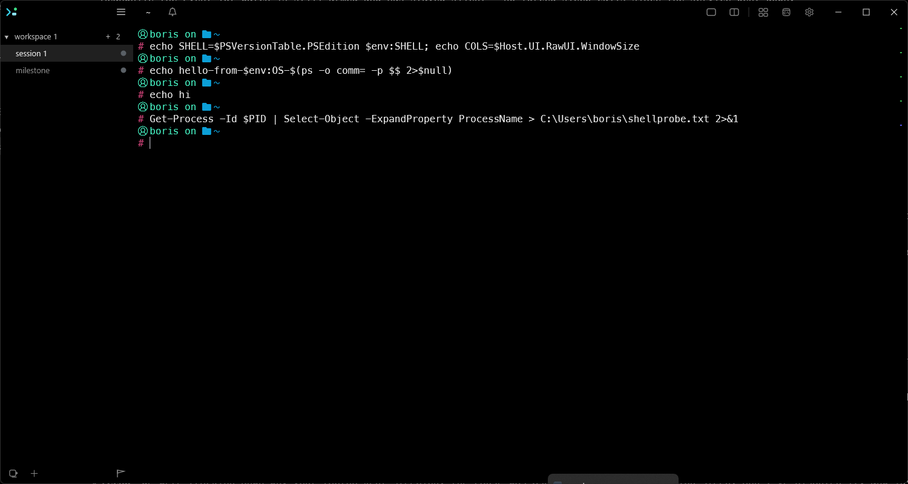
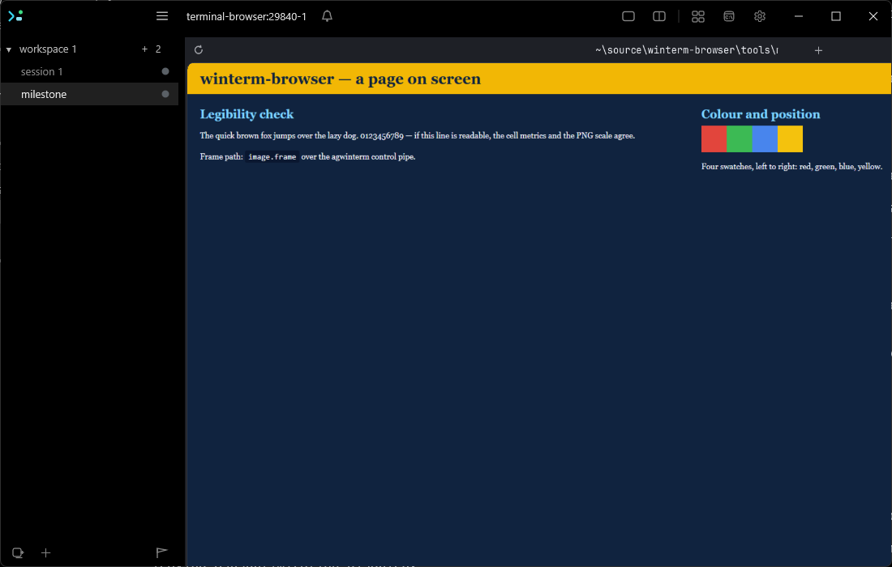
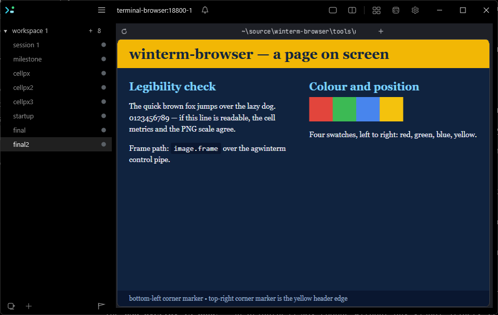

# winterm-browser — Windows-native port

> **Revision 2**, after a revmux triage panel (`.revmux/tasks/plan-windows-port/01-initial`) raised
> 4 critical and 19 major findings against revision 1. Four things changed structurally: an
> architecture decision task now precedes all console work; the Electron install and launcher move
> ahead of the milestone; `terminal.rs` is split rather than gated; and the file-based frame path
> writes unique paths. Findings are cited inline as `[triage: …]` where the reason is not obvious.

## Overview

Bring terminal-browser to Windows, hosted by agwinterm: a real Chromium browser rendered inside a
terminal pane, with working keyboard and mouse, on stock Electron, with no WSL.

The authoritative design is [`docs/design/00-port-brief.md`](../../design/00-port-brief.md). Read it
first — it records what was measured rather than assumed, and it has now been corrected twice by
evidence. In short:

- Upstream cannot run here for two independent reasons: `pixel-core` does not compile on Windows
  (41 errors), and its transport — Kitty APC escapes on stdout — is stripped by ConPTY.
- The unix dependency is **concentrated**: 64 of 68 unix-API references are in `terminal.rs`;
  **43 of `pixel-core`'s 46 source files have none**. The compositor, layout and text stack are
  portable Rust, and the browser chrome renders through them — so keeping `pixel-core` avoids
  rewriting the chrome.
- But `terminal.rs` is itself split: lines 1251–1909 are a 659-line VT input decoder with zero unix
  references and 27 passing byte-sequence tests. That decoder is what the Windows backend needs.
  Gating the module wholesale would strand it.
- Upstream's fast frame paths need an Electron fork they build themselves, but `presentBitmap`
  (`browser/src/page/paint.ts:104`) already implements a stock-Electron path.

**So the port is: split one module, port one, drop one, keep forty-three** — plus a new output
backend on agwinterm's control pipe, and an architecture decision about where the engine runs.

### What this port cannot fix, and is accepting

Two ceilings are host-side and are accepted rather than solved here
[triage: mouse quantisation, cell metrics]:

- **Pointer resolution is one character cell.** agwinterm discards the sub-cell offset at the encode
  site and has no `?1016`. Small link targets, hover, drag-select and scrollbar grabs all quantise.
- **Cell pixel metrics are not published**, so the renderer cannot match the pane's physical pixels
  without a host change — the frame is resampled to fit the pane. Task 6 settled the mechanism
  (`session.metrics`) and shipped `TERMINAL_BROWSER_CELL_PX` as the explicit way to render sharp
  meanwhile.

Both have a cheap host-side fix, and both are now **explicit dependencies on the agwinterm plan**
rather than assumptions. If that plan does not ship them, this port still works — with a
cell-resolution pointer and a possibly-resampled image — and that is the documented outcome, not a
surprise discovered at Task 11.

## Context (from discovery)

Upstream reference (read-only, never committed): `.reference/terminal-browser/`.
agwinterm source: `C:\Users\boris\source\agwinterm`.

| area | file | note |
|---|---|---|
| tty layer to replace | `pixel-core/src/terminal.rs` lines 4, 193–1250 | termios raw mode, `/dev/tty`, `rustix::shm`, `pipe`+`O_NONBLOCK`, Kitty-to-stdout encoder |
| **decoder to keep** | `pixel-core/src/terminal.rs` lines **1251–1909** | zero unix refs; `parse_csi`, `parse_sgr_mouse`, `parse_kitty_keyboard`, `parse_osc_color`, … all take `&[u8]` |
| **types to extract** | `terminal.rs:11-175` | `Event`, `KeyEvent`, `KeyKind`, `Mods`, `Key`, `Mouse`, `MouseKind`, `MouseButton`, `TerminalColors`, `ColorSlot`, `WindowSize`, `Waker`, `SessionEnv` — imported by 11 keep-unchanged modules; `lib.rs` re-exports `SessionEnv` at crate root |
| seam width | `impl Terminal`, `terminal.rs:336-1061` | **24 public methods**, including 5 clipboard calls reached via `&mut Terminal` from `engine/clipboard.rs` |
| IPC to port | `pixel-core/src/herdr.rs` | `UnixStream`/`UnixListener` → named pipes, or gated off for v1 |
| to drop | `pixel-core/src/ghostty.rs` | `SIGUSR2` to ghostty; no Windows analogue |
| daemon architecture | `cli/src/main.ts:119,155,301`, `browser/src/daemon.ts:96-106`, `browser/src/main.tsx:55` | tty-by-path into a detached daemon; no Windows analogue |
| launcher | `cli/src/main.ts:65-68,80-86,109` | `/bin/sh -c`, `ELECTRON_DEV_BIN=["electron"]` (no `.exe`), POSIX quoting, `2>>` redirection |
| install hook | `browser/package.json:7` | `"postinstall": "bash ../scripts/fetch-electron.sh"` — fetches the fork |
| pnpm gate | `pnpm-workspace.yaml` | `onlyBuiltDependencies: [better-sqlite3, esbuild]` — **electron is not listed**, so its own binary download is blocked |
| napi bridge | `pixel-node/src/{lib,surface}.rs` | `Owned { bgra, width, height }` is ungated and is the Windows path; buffer recycling at `surface.rs:53-58` is built around it |
| unix sockets | `store/src/paths.ts:46-48`, `browser/src/daemon.ts:38-39`, `browser/src/registry.ts:52-57` | **two** socket protocols, persisted in `store/src/schema.ts:7`, consumed by 4 CLI modules |
| the seam | `Surface.present` from `pixel-react` | what `browser/` calls; the Windows backend plugs in here |
| host frame path | agwinterm `ControlServer.cs:249`, `HandleImageFrame` at `:426` | `ContentSignature` at `:487-496` is mtime^length^hash(path) — it never reads bytes |

**Tooling**: `cargo nextest run --workspace`, `cargo clippy --workspace --all-targets -- -D warnings`,
`cargo fmt --all --check`, `node --test`. `pixel-core` has **246 `#[test]` functions across 25 files**;
~197 are in keep-unchanged modules and become a live per-task regression net the moment Task 4 lands.

## Constraints

- **Windows-native only. WSL is out of scope** and is not an acceptable fallback for any task.
- **Stock Electron.** No patched build. Note this is not free: removing the fork fetch without also
  allowing electron's own postinstall leaves `node_modules/electron/dist` empty and no `electron.exe`
  anywhere — a worse failure, hit at the milestone rather than at install. Task 1 handles both halves.
- **This plan depends on the agwinterm plan** for three things now, not one: `image.frameshm`
  (Task 12, optional, self-guarding), cell metrics (Task 6, ~~blocking~~ **degrades** — Task 6
  found that a wrong-but-consistent cell size costs sharpness, not click accuracy, and shipped an
  explicit override; see [`docs/design/04-cell-metrics.md`](../../design/04-cell-metrics.md)), and
  `?1016` pixel mouse (Task 11, degrades gracefully). Contract lives in `agwinterm/docs/specs/image-frameshm.md`.
  **Tasks 1–10 have zero dependency on the agwinterm plan** [triage: confirmed against
  `HandleImageFrame` — every capability Task 7 needs is in shipped code].
- **Never test against the real agwinterm instance.** Debug build → instance id `agwinterm-dev`, own
  pipe and data dir. Verify with `agwintermctl --pipe agwinterm-dev tree` before trusting a result.
- **Do not weaken the 43 keep-unchanged files to make something compile.** A needed change there is a
  ➕ finding, not a quiet edit.

## Development Approach

- **Testing approach**: Regular (code first, then tests).
- Complete each task fully before moving to the next.
- **CRITICAL: every task MUST include new/updated tests**, as separate checklist items, covering
  success and error scenarios.
- **CRITICAL: all tests must pass before starting the next task.**
- **CRITICAL: update this plan file when scope changes during implementation.**
- `cargo clippy -- -D warnings` and `cargo fmt --check` are part of "tests pass".

## Testing Strategy

- **Unit tests**: every task. Rust via `cargo nextest`, TypeScript via `node --test`.
- **Platform-behaviour tests**: prefer driving the real thing (a real named pipe, a real
  `MemoryMappedFile`, a real Debug agwinterm) over a mock encoding a guess about Win32.
- **The ~197 inherited tests are the regression net.** From Task 4 onward they must run on Windows
  and stay green; that is what makes "keep forty-three unchanged" a checkable claim.
- **Visual confirmation is a milestone, not a test** (Task 10). Screenshots go in Post-Completion.

## Progress Tracking

- Mark completed items `[x]` immediately. Add discovered tasks with ➕. Blockers with ⚠️.

## Implementation Steps

### Task 1: Vendor, make `pnpm install` actually work, and take a full-tree baseline

- [x] copy upstream `engine/`, `browser/`, `cli/`, `terminals/`, `store/` into the repo root,
      preserving `LICENSE`, and record the upstream commit in `docs/design/UPSTREAM.md`
      — ⚠️ **there is no commit to record**: the reference checkout carries no VCS metadata, so
      `UPSTREAM.md` records content digests instead. Also vendored `assets/` (root, distinct from
      `engine/assets/` — `session.tsx:89` resolves it at runtime) and `package.json` /
      `pnpm-workspace.yaml` / `pnpm-lock.yaml`. The Rust workspace root stays at `engine/`, so
      cargo commands run from there, not the repo root.
- [x] do **not** copy `install.sh`, `fetch-electron.sh`, `apparmor.sh`, `bundle.sh` — `scripts/`
      was not copied at all; also skipped `herdr-plugin/`, `release-worker/`, `skill/`
- [x] **remove the `postinstall` hook from `browser/package.json:7`** — it runs `bash` on the
      patched-Electron fetch script the Constraints forbid, and with `scripts/` uncopied it fails on
      a missing file regardless. Record it as the first intentional divergence from upstream.
- [x] **add `electron` to `onlyBuiltDependencies` in `pnpm-workspace.yaml`** (or fetch the stock
      binary explicitly) — pnpm 10 blocks the electron package's own binary download, which is *why*
      upstream substituted the fork fetch. Removing the hook alone yields an install that succeeds
      and still has no Electron binary. [triage: critical]
      — ➕ **the premise no longer holds for Electron 43.3.0: it has no `postinstall` at all.**
      It dropped one and downloads lazily on first `require("electron")`, so listing it in
      `onlyBuiltDependencies` is currently inert. Both halves were done anyway: the entry is kept
      for a version that reinstates a build script, and the hook was **replaced** rather than
      removed, with `node node_modules/electron/install.js` — cross-platform, stock binary,
      idempotent. That is the plan's "or fetch the stock binary explicitly" branch.
- [x] run `pnpm install` and confirm `node_modules/electron/dist/electron.exe` exists — this is the
      pass/fail, not "the command exited 0"
      — verified at `browser/node_modules/electron/dist/electron.exe`, 348 MB, stock 43.3.0 win32-x64,
      produced by `pnpm install` alone from a deleted `dist/`. Note `pnpm` is not on PATH on this
      machine; it runs via `corepack pnpm` (10.13.1, matching `packageManager`).
- [x] run `cargo check --workspace`; commit the error list to `docs/design/01-baseline-errors.md`
      — **41 errors, in exactly 3 files** (`terminal.rs` 37, `ghostty.rs` 3, `herdr.rs` 1); the other
      43 `pixel-core` files produce zero. Not one error falls in `terminal.rs:1251–1909`. The brief's
      numbers are confirmed. `openh264-sys2` builds clean under MSVC, closing a Task 8 risk early.
      ⚠️ `cargo fmt --all --check` reports 172 diffs across 30 vendored files, most of them
      keep-unchanged — see the disposition in the baseline doc; the check is scoped to code this
      port writes, since reformatting them is the silent edit the Constraints forbid.
- [x] **run the same unix-API disposition pass over `browser/`, `cli/`, `store/`, `terminals/` and
      the JS build scripts**, recording it beside the `pixel-core` table — the Rust measurement
      covered the least risky layer, and every blocker found so far was outside it [triage: major]
      — 27 files, ranked by disposition in the baseline doc. Also recorded: the vendored
      `pixel-terminals` suite is 28/29 on Windows, and the one failure is pre-existing upstream
      breakage (`herdr.ts:45` has no fallback), not a porting problem.
- [x] **probe ConPTY input fidelity**: from a child under a Debug agwinterm with
      `ENABLE_VIRTUAL_TERMINAL_INPUT` set, record the exact bytes received for an SGR mouse report
      and a kitty-keyboard CSI-u report. These are synthesized host-side and pass through conhost's
      `INPUT_RECORD` round-trip; CSI-u forms are exotic and Task 11 is the first thing that would
      notice a loss. Record next to the `cargo check` baseline. [triage: minor, cheap, de-risks two tasks]
      — done against a **real ConPTY created by the probe itself** (`tools/conpty-probe`) rather than
      a Debug agwinterm: no agwinterm build exists on this machine, only the live instance the
      Constraints forbid touching, and the risk being measured is conhost's, not agwinterm's.
      **Result: every sequence survives verbatim** — SGR press/release/drag, three-digit coordinates,
      CSI-u plain and modified, modified arrows, and a four-sequence burst. Task 11's "if CSI-u did
      not survive" branch can be closed.
      — ➕ **a ConPTY child's std handles can be `NUL` while it is attached to the pty**:
      `GetFileType` says `FILE_TYPE_CHAR`, every console API returns `ERROR_INVALID_HANDLE`, and the
      process looks console-less. Task 5 must open `CONIN$`/`CONOUT$` by name — the analogue of
      upstream opening `/dev/tty` rather than using fd 0. This was the cause of a first probe run
      that reported *everything* dropped, control case included.
- [x] write a test asserting the vendored `pixel-core` file inventory (46 files) matches expectation,
      so a re-vendor cannot silently add a unix-bound module
      — `tools/vendor-check/inventory.test.mjs`: 46 files, exact set match, unix APIs confined to the
      3 replaceable modules, 43 files unix-free, and the decoder region still unix-free. A companion
      `install.test.mjs` pins the two install fixes so a re-vendor cannot silently undo them.
      Note `throttle.rs` carries `#[cfg(target_os = "macos")]` code and compiles on Windows
      untouched, so the scan matches unix *APIs*, not any platform mention.
- [x] run tests — must pass before Task 2 — 14 node tests + 15 Rust tests green; `cargo fmt --check`
      and `cargo clippy -- -D warnings` clean on `tools/conpty-probe`

### Task 2: Decide where the engine process lives on Windows

**This is a design task and it blocks all console work.** Upstream's daemon opens the client's tty by
path; Windows has no path that names another process's ConPTY, and the daemon is spawned detached
with no console at all. [triage: critical]

- [x] write `docs/design/03-process-model.md` choosing between: (a) host the engine in the foreground
      process, or (b) keep the daemon and forward stdin from the CLI client over IPC
      — **(a).** One browser process per pane, attached to that pane's console. The daemon stays in
      the tree, still entered by `--daemon`, and is not what the Windows CLI launches.
- [x] cost each against what it actually touches. For (a): `browser/src/main.tsx:55` calls
      `runDaemon(cdpPort)` unconditionally and does not inspect the `--daemon` argument, so there is
      no foreground mode to switch to — this is a restructure of the browser process's top level, not
      a flag. For (b): input latency, and a second stdin protocol to own.
      — costed in the doc. (a)'s real price is one Chromium per pane and per-pane profiles;
      `claimProfile()` already hands 32 concurrent processes their own `userData` dir, and the
      instance registry is already keyed per session, so neither needed new code.
      ➕ **(b) is much larger than "a second stdin protocol"**: `query_colors` (`terminal.rs:892`)
      and `cell_size` (`:869`) write a query and read the reply off the same descriptor under a
      300 ms deadline, and 5 clipboard calls (`:1035-1057`) are reached through `&mut Terminal` from
      `engine/clipboard.rs`. (b) is a bidirectional RPC over the whole 24-method seam, plus loading
      the native addon into the Node CLI to touch `CONIN$` at all. Latency was never the issue.
- [x] note that `createRoot({tty: null})` is already a supported shape
      (`pixel-react/src/index.ts:262-264` falls back to a stdio bridge; `session.tsx:313` has a
      `!this.ctx.tty` branch) — this is the seam either option builds on
      — confirmed, and `SessionContext.tty` is optional (`session.tsx:49`), so `foreground.ts`
      simply does not set it. (a) adds no new engine code path.
- [x] confirm the output side is unaffected either way: frames leave via the control pipe addressed
      by `AGWINTERM_SESSION_ID` and never need a tty
      — confirmed, including for the daemon shape, which looks like it should break the addressing
      and does not: the client already sends `env: process.env` (`cli/src/main.ts:206`), the daemon
      forwards it (`daemon.ts:109`), and it reaches the engine as `sessionEnv` (`session.tsx:318`),
      where `SessionEnv::of_session` (`terminal.rs:320`) exists for exactly this. The decision rests
      on input alone.
- [x] record the decision, the rejected option and why, so Task 5 has a brief to work from
      — "What Task 5 must do, that upstream did not", four numbered items, plus a third shape
      (per-pane console proxy to a shared daemon) considered and rejected as strictly worse than (b).
- [x] write tests for whichever process-boundary shape is chosen, at the level the decision permits
      (an IPC round-trip test for (b); a foreground-entry smoke test for (a))
      — two layers. `tools/console-inherit-probe` (new crate) measures the Win32 fact the decision
      rests on with real processes: a real ConPTY, a console-subsystem middle standing in for the CLI,
      and a grandchild standing in for `electron.exe`, both grandchildren running the identical body
      so the PE subsystem is the only variable. `tools/process-model/entry.test.mjs` is the
      foreground-entry smoke test; it compiles the import-free `browser/src/entry.ts` with the repo's
      esbuild (`browser/` cannot be typechecked until `pixel-react` builds in Task 8) and asserts the
      wiring in `main.tsx`/`foreground.ts` by reading them.
      ➕ **the measurement overturned the assumption behind (a)**: a GUI-subsystem child is *not*
      given the pane's console even on an ordinary spawn — `CONIN$` fails with `ERROR_INVALID_HANDLE`
      — while the console-subsystem control gets it for free. Electron is `SUBSYSTEM_WINDOWS_GUI`
      (pinned by a test against the installed 43.3.0 binary). It can *take* the console with
      `AttachConsole`, by parent or by named pid, and then reads the pane's SGR mouse report
      verbatim. **Task 5's `open` therefore needs an attach step upstream never had.**
      ➕ `AttachConsole` on an already-attached process returns `ERROR_ACCESS_DENIED` — one console
      per process, measured. That, not `DETACHED_PROCESS`, is what rules the daemon out; a detached
      child re-attaches to its parent's console fine, so "drop `detached: true`" is not a fix.
      ➕ scope: the decision was made executable rather than left on paper — `browser/src/entry.ts`,
      `browser/src/foreground.ts`, and a three-line switch in `main.tsx`. Off Windows nothing changes,
      because the CLI still passes `--daemon` and that still selects the daemon.
- [x] run tests — must pass before Task 3 — 14 Rust tests in `console-inherit-probe` (7 unit,
      7 driving real pseudoconsoles) plus 24 node tests across `tools/`; `cargo fmt --check` and
      `cargo clippy --all-targets -- -D warnings` clean on the new crate; `conpty-probe`'s 15 still
      green; `engine`'s `cargo check --workspace` still exactly the 41 baseline errors.

### Task 3: Extract `terminal.rs`'s portable type vocabulary

Done before any gating, because `lib.rs` declares `mod terminal;` unconditionally and re-exports
`pub use terminal::SessionEnv;` at crate root — a bare `#[cfg(unix)]` breaks the crate root and 11
keep-unchanged modules. [triage: major]

- [x] move `Event`, `KeyEvent`, `KeyKind`, `Mods`, `Key`, `Mouse`, `MouseKind`, `MouseButton`,
      `TerminalColors`, `ColorSlot`, `WindowSize`, `Waker`, `SessionEnv` into their own module
      — `pixel-core/src/terminal_types.rs`, the crate's 47th file and the first the port adds.
      Three private members widened to `pub(crate)` because the decoder and the tty code still
      construct them: `KeyEvent::plain` (18 call sites, all in the decoder), `TerminalColors::set`
      (`terminal.rs:986`), and `Waker.fd` (built at `:774`, read at `:785`). Nothing became `pub`.
      ⚠️ **`Waker` is in the vocabulary but is not portable**: its body is the write end of the tty
      backend's self-pipe (`rustix::fd::OwnedFd`). It moved because `lib.rs` exports it at the crate
      root, so gating it would break the root — but Task 5 replaces the body, not just the backend.
      It happens to *compile* on Windows (rustix aliases `fd` to the socket types there), which is
      why the baseline error count did not move; that is not the same as working.
- [x] **re-export them from `terminal`** so all 11 importers and `lib.rs`'s `pub use` are untouched:
      `engine/{clipboard,doc,embed,input,keys,mod,pointer,scroll}.rs`, `menu.rs`, `native.rs`,
      `text_input.rs`
      — one `pub use crate::terminal_types::{…}` at `terminal.rs:14`. All 11 importers and both of
      `lib.rs`'s `pub use terminal::…` lines are byte-identical; `git diff` inside `pixel-core` is
      two files, and `lib.rs`'s is a single added `mod terminal_types;`.
- [x] verify `text_input.rs`'s tests still resolve `crate::terminal::Mods` and `KeyKind` (:1345-1351)
      — verified by compiling, not by reading: `cargo check -p pixel-core --all-targets
      --target x86_64-unknown-linux-gnu` is clean, and that target is the only one on which the
      crate compiles at all today. ➕ **cross-checking against a unix target is how this task got
      real verification on a Windows box.** `rustup target add x86_64-unknown-linux-gnu` plus
      `cargo check` needs no linker, so the unix build — including every `#[cfg(test)]` target — is
      compile-verified here. This is a development check, not a WSL fallback; nothing runs.
- [x] note in the commit that a re-export shim is the expected diff, so Task 14's unchanged-check
      does not read it as a violation
      — noted in the commit body, and made mechanical rather than remembered: the Task 1 vendor-check
      now separates `PORT_ADDED_FILES` from upstream's 46 and asserts the shim's shape directly
      (every moved name re-exported, no importer rewritten onto the new path, `lib.rs` limited to the
      one `mod` line). Its decoder-region test was re-anchored to `enum RawEvent` … `mod tests`
      instead of hardcoded lines 1251-1909, since this extraction shifted the region up by 178 lines
      and Task 4's gating will move it again.
- [x] write tests asserting each re-exported path still resolves (a compile-level test module)
      — `terminal_types.rs`'s `mod tests`: three sub-modules naming the vocabulary through
      `crate::terminal::_`, through the crate root, and as the importers themselves spell it, plus a
      test that a value built through one path is assignable through another (a duplicate definition
      rather than an alias would fail to compile there). Five behavioural tests cover the moved
      bodies — `KeyEvent::plain`, `TerminalColors::set`, `WindowSize::cell_size`, `SessionEnv::var`.
      ⚠️ The compile-level half is verified now; the `#[test]` bodies cannot *run* until Task 4 makes
      `pixel-core` build on Windows, since running them on a unix target would need WSL.
- [x] run tests — must pass before Task 4 — 30 node tests (24 before, +6 for the split), 15
      `conpty-probe` and 14 `console-inherit-probe` Rust tests still green. `cargo check -p
      pixel-core --all-targets --target x86_64-unknown-linux-gnu` clean; `cargo clippy` on that
      target yields a warning set **identical to HEAD's, file for file** (15, all pre-existing
      upstream); `rustfmt --check` clean on `terminal_types.rs` and unchanged (23 diffs, as before)
      on the vendored `terminal.rs`. `cargo check --workspace` on Windows: still exactly the 41
      baseline errors, in the same three files.

### Task 4: The backend seam — gate the tty code, keep the decoder

- [x] define `TerminalBackend` covering the **24 public methods** of `impl Terminal`
      (`terminal.rs:336-1061`): `new`, `open`, `reports_color_scheme`, `relayed`, `kitty_keyboard`,
      `set_key_event_types`, `draw`, `read_event`, `poll_event`, `waker`, `watch_resize`, `size`,
      `reports_pixel_mouse`, `frames_are_inline`, `forget_cell_size`, `cell_size`, `query_colors`,
      `request_colors`, `set_pointer_shape`, `set_clipboard`, `request_clipboard`,
      `clipboard_data_supported`, `request_clipboard_types`, `request_clipboard_data`
      — `pixel-core/src/terminal_backend.rs`, all 24, each with the signature it already had.
      The trait is `Sized`, not object-safe: `new`/`open` are constructors and the engine holds
      one backend chosen at compile time. Its doc comment records the four contract properties
      the signatures cannot state — raw mode tied to the value's lifetime, one event per
      `poll_event`, clipboard reads as request/response, capability getters cheap and infallible.
- [x] the five clipboard methods are **not optional** — `engine/clipboard.rs` takes `&mut Terminal`
      at `:96,:121,:157,:181,:220`. They are OSC-52-shaped and return `io::Result`, so they trait
      cleanly, but they must be on the trait [triage: major, revision 1 omitted clipboard entirely]
      — all five are on the trait. ➕ **The plan's description of the reply path was wrong**: there
      is no `Event::ClipboardTypes`. `request_clipboard_types`' answer arrives as an
      `Event::ClipboardData` whose `"."`-mime item holds the space-separated type list, which is
      how `engine/clipboard.rs`'s `OscPasteStage::Types` reads it. The fake backend replays that
      exact sequence rather than the one the plan imagined.
- [x] derive the trait from existing callers, not from a fresh design
      — enumerated mechanically: 21 of the 24 are called as `term.<method>(` from `engine/` and
      `pixel-node/`; `new`/`open` are the pair `engine/mod.rs:339-340` picks between; `read_event`
      is exported but not called in-tree. No method was invented, and none was left off.
- [x] **`#[cfg(unix)]` covers the tty and frame-transport code only (lines 4, 193–1250).
      Lines 1251–1909 — the VT decoder — and its `#[cfg(test)] mod tests` at 1911 stay
      unconditional.** Gating the module wholesale strands 659 lines of portable code and 27 tests
      that Task 5 needs. [triage: major]
      — 41 `#[cfg(unix)]` attributes on the top-level items of the tty region, plus 3 on the
      tty-bound tests inside `mod tests` (`parses_probe_replies`, the `FrameFile` round-trip, the
      shm round-trip) and one on `mod tty_tests`. `git diff` on `terminal.rs` is **41 pure
      insertions and no rewritten line** — the gate is an attribute, never an edit to the code
      under it. ➕ **One item moved out of the gated set: `ClipRead`.** It sits inside the tty
      region by position only — three plain fields, no platform dependency — and the decoder's own
      `clip_data_chunks_of_one_mime_concatenate` test constructs one. Gating it would have cost a
      28th decoder test for nothing.
- [x] add a `#[cfg(windows)]` stub returning "unimplemented" for every method
      — `pixel-core/src/terminal_windows.rs`, re-exported as `crate::terminal::Terminal` from
      `terminal.rs`, so `lib.rs`'s crate-root `pub use terminal::Terminal` and all 11 importers
      resolve on both platforms with no edit. Every operation returns `ErrorKind::Unsupported`
      with a message naming the task that will implement it (5/6/7/11), and every capability
      getter returns `false`.
      ⚠️ **Construction is the deliberate exception: `new`/`open` succeed.** They make no OS call —
      they only record the wrapper and session env Task 5 and Task 6 need — and letting them
      succeed is what makes `engine/mod.rs` reachable on Windows now. The cost is that the trait's
      raw-mode contract is satisfied only vacuously here; Task 5 puts a real `SetConsoleMode` pair
      behind it, including on the panicking path.
- [x] `#[cfg(unix)]`-gate `ghostty.rs`; record `herdr.rs` as deferred to Task 13
      — both gated at their `lib.rs` declaration rather than inside the files, so neither vendored
      file changed a byte. `herdr.rs` is referenced only from the gated tty region (its `FrameFile`
      import and its `Herdr` fields), so nothing else had to move; Task 13 owns replacing its
      `UnixStream`/`UnixListener` with named pipes. `inventory.test.mjs` now asserts both gates.
- [x] verify `cargo check --workspace` is clean on Windows — the task's real deliverable
      — **`cargo check -p pixel-core` is clean**: 41 errors → 0, and `--all-targets` is clean too,
      so every `#[cfg(test)]` target builds. Warnings match the unix build exactly (2, both
      pre-existing in `throttle.rs`).
      ⚠️ **The workspace is not clean, and cannot be at this task.** With `pixel-core` compiling,
      `pixel-node`'s own Windows errors surface for the first time — 2 of them,
      `capture.rs:4` (`std::os::unix`) and `capture.rs:439` (`File::read_exact_at`).
      `docs/design/01-baseline-errors.md` predicted exactly this ("`pixel-node`'s real Windows
      disposition is unknown until Task 4 unblocks it, and Task 8 is where it gets measured"), so
      this is the measurement, handed to Task 8, not a regression.
      ➕ Keeping the warning set at parity took three scoped `#[cfg_attr(windows, allow(dead_code))]`
      on `mod kitty`, `mod terminal` and `mod terminal_types` in `lib.rs`. Without them the gate
      produces 47 dead-code warnings, because the decoder is kept but has no caller until Task 5
      and `kitty.rs`'s emitters lost theirs. Scoped to three modules and to Windows rather than
      crate-wide, and the unix build still reports dead code in those files normally.
- [x] verify the ~197 inherited tests in keep-unchanged modules now **run and pass on Windows**;
      record the count, since it is the regression net for every task after this
      — **203, all green** (the plan's estimate was 197). Full Windows run: **247 passed, 0
      failed** = 203 inherited + 25 decoder tests in `terminal.rs` + 19 port-added
      (`terminal_backend` 9, `terminal_windows` 5, `terminal_types` 5).
      ➕ **Three of the 203 failed on the first run, and the cause matters more than the fix.**
      `clipboard_image.rs` is one of the 43 files the port calls portable, and it is — it uses no
      unix *API*, which is exactly what `inventory.test.mjs` screens for. It assumed unix *paths*:
      it gated pastes on a leading `/` or `~` (rejecting every `C:\…` as prose), expanded `~`
      through `HOME` (Windows spells it `USERPROFILE`), and unescaped every backslash (turning
      `C:\Users\me\a.png` into `C:Usersmea.png`). Fixed with three `cfg!(windows)` branches, unix
      behaviour byte-for-byte unchanged, recorded as divergence 4 in
      [`UPSTREAM.md`](../../design/UPSTREAM.md) and pinned by three new vendor-check assertions.
      ⚠️ **"No unix API" is not "portable", and the screen that cleared all 43 cannot see this
      class of problem.** Task 14's unchanged-check should expect that list to grow.
- [x] write tests for the trait contract against a fake backend: event ordering, size reporting,
      raw-mode enter/leave pairing, clipboard request/response
      — 9 tests in `terminal_backend.rs`'s `mod tests`, against a `FakeBackend` that logs what it
      did into a handle outliving it (so the `Drop` that restores raw mode is observable). Covers
      all four named properties: one event per `poll_event` in arrival order and `read_event`'s
      `UnexpectedEof` at the end; size in cells and pixels plus `cell_size` caching and what
      `forget_cell_size` is for; enter-on-construction / leave-exactly-once-on-drop **and** that a
      *failed* construction logs no enter it will never pair with a leave; the full clipboard
      request/response sequence — text, then types, then typed data — with a write proving it
      produces no event. Plus capability getters touching nothing, and `draw` reporting its bytes.
- [x] run tests — must pass before Task 5 — **247 Rust tests pass on Windows** (0 failed) and
      **37 node tests** (34 before, +3 for divergence 4; the seam suite added 4 more inside the
      existing count). Cross-checked against `x86_64-unknown-linux-gnu`: `cargo check --all-targets`
      clean, so the gated tty code and `tty_tests` still compile. `cargo clippy --all-targets` on
      that target is **identical to HEAD's, file for file** (15, all pre-existing upstream); on
      Windows it is 5, all pre-existing. `cargo fmt --check`'s residual diff set is **identical to
      HEAD's, file for file** — the two port-added files are fmt-clean, and placing
      `pub use terminal_backend::TerminalBackend;` in sorted position kept `lib.rs` at its prior
      count. ➕ New vendor-check suite "the backend seam" pins the split: no `#[cfg(unix)]` inside
      the decoder region, `impl Terminal` gated, the Windows re-export present, the trait declaring
      exactly the 24 names, and both backends carrying every one of them. Verified to have teeth by
      adding a 25th method and watching it fail.

### Task 5: Windows console input

- [x] implement the input half of the Windows backend, **in the process Task 2 chose**
      — `pixel-core/src/terminal_windows.rs` grew from a 24-method stub into the real thing:
      `AttachConsole` (named pid first, `ATTACH_PARENT_PROCESS` as fallback, `ERROR_ACCESS_DENIED`
      read as "already attached"), `CONIN$`/`CONOUT$` opened **by name**, the raw-mode pair, the
      reporting-mode setup and teardown, `read_event`/`poll_event`/`waker`/`watch_resize`/`size`.
      All four numbered items in [`03-process-model.md`](../../design/03-process-model.md)'s Task 5
      brief are implemented; the doc now records what was built and what Task 9 owes it.
      ➕ **The env var that carries point 3's process id is named here:
      `TERMINAL_BROWSER_CONSOLE_PID`**, read through `SessionEnv` rather than `std::env` so it
      also works in the daemon shape. Task 9's launcher sets it.
- [x] enable VT input with `SetConsoleMode` (`ENABLE_VIRTUAL_TERMINAL_INPUT`, line and echo input
      off), restoring the prior mode on exit **including on panic**
      — `raw_input_mode` clears `ENABLE_LINE_INPUT|ENABLE_ECHO_INPUT|ENABLE_PROCESSED_INPUT` and
      sets `ENABLE_VIRTUAL_TERMINAL_INPUT`, preserving every other bit; that is exactly the set
      `tools/console-inherit-probe` measured reading an SGR mouse report off a real ConPTY, and it
      was not widened on a guess. `vt_output_mode` adds `ENABLE_VIRTUAL_TERMINAL_PROCESSING` and
      `DISABLE_NEWLINE_AUTO_RETURN` to `CONOUT$`. Restoration is a `ModeGuard` whose `Drop` puts
      back the exact mode it read **and** a process-global registry walked by a `panic` hook, so a
      panic on another thread — or one that skips a destructor — still leaves the pane usable.
- [x] **reuse the existing decoder at `terminal.rs:1251-1909` — do not write a second one.** It
      already handles kitty CSI-u, SGR mouse, OSC color and incomplete tails; its
      `parse_event_consumes_one_event_and_reports_incomplete_tails` test (:2144) is exactly the
      split-across-two-reads case
      — `poll_event` calls `parse_event_kitty` and nothing else parses. The whole cost was
      **five visibility widenings in `terminal.rs`** (`parse_event_kitty`, `parse_osc_color`,
      `RawEvent`, `ClipStatus`, `ClipPacket` → `pub(crate)`); no line of decoder logic changed and
      `terminal_windows.rs` defines no `parse_` function of its own, which a new vendor-check
      assertion enforces. `terminal.rs` is one of the three modules `UPSTREAM.md` excludes from
      the divergence list, so this is port subject matter rather than a divergence.
- [x] handle resize from the console screen buffer, since there is no `SIGWINCH`
      — `watch_resize` takes a baseline from `GetConsoleScreenBufferInfo` and `poll_event` caps
      its wait at 100 ms so it can re-read and emit `Event::WindowSize` on a change. **`srWindow`,
      not `dwSize`**: under a pseudoconsole they are equal, but under a plain conhost `dwSize.Y`
      is the scrollback height and would report tens of thousands of rows. Pixels are reported as
      zero rather than guessed, so `WindowSize::cell_size()` answers `None` — Task 6's question,
      left open on purpose. Mode 2048 in-band reports are decoded for free if the host ever sends
      them, and share the same baseline so a resize cannot be announced twice.
- [x] write tests only for what is genuinely new — the Windows read loop, mode set/restore, and
      resize — rather than re-testing the inherited parser
      — 21 tests, and the platform ones drive the real API rather than a mock of it: the read
      loop runs over a **real anonymous pipe**, and the mode and size calls run against a **real
      private console screen buffer** (`CreateConsoleScreenBuffer`), which is a genuine console
      object whose modes can be changed without disturbing the terminal the suite is running in.
      Covered: bytes → events in arrival order, one per call; an event split across two reads
      held until whole; timeout honoured; `read_event` blocking; the waker interrupting a
      deadline-less wait, and not being lost when it arrives first; a reader error surfacing as
      itself rather than as end of input; resize seen with no input at all; resize silent until
      asked for; the in-band/screen-buffer double-up; the reporting modes being symmetric; and
      the palette drain not hanging on a terminal that never answers.
      ➕ **The obvious read loop is wrong, and wrong on every keypress.** Waiting on the console
      input handle and then calling `ReadFile` fails because a record that translates to no bytes
      (key-up, focus, buffer-size) signals the handle and is then consumed silently, so the read
      blocks past the caller's deadline — and one keypress queues exactly such a record. The
      blocking read therefore lives on its own thread feeding an `Inbox`. That is also what
      `Waker` carries on Windows, so `terminal_types.rs`'s `Waker` is now platform-split: same
      name, same `wake()`, `#[cfg(unix)]` fd or `#[cfg(windows)]` inbox.
      ➕ **`query_colors` and `request_colors` were implemented too, though the plan did not list
      them.** `engine/mod.rs:345` calls `query_colors()?` in the constructor and `request_colors`
      on every focus change, so leaving them `Unsupported` would have made the engine
      unconstructible on Windows — and both are write-then-read-the-reply operations that only
      this task's console I/O can provide. They reuse the decoder's `parse_osc_color`.
      `cell_size` deliberately stays unimplemented: it is Task 6's decision, not this one's.
- [x] write tests for raw-mode restoration on the normal and panicking exit paths
      — `entering_and_leaving_a_mode_round_trips_a_real_console_handle` (drop path, asserting the
      exact prior mode comes back), `the_panic_hook_restores_a_mode_no_drop_would_reach` (the
      registry walk on its own), `a_panicking_exit_path_leaves_the_console_as_it_was_found`
      (a real `catch_unwind`, recording from inside that the mode really did change first, so a
      run that changed nothing cannot pass by doing nothing), and
      `a_failed_apply_registers_nothing_it_will_never_pair`. ⚠️ **The mode tests hold a shared
      mutex**: the registry and the panic hook are process-global, so one test's deliberate panic
      would otherwise restore another test's mode early. ⚠️ **The input half's `SetConsoleMode`
      is unit-tested as a bitmask, not against a real input handle** — there is one console input
      buffer per process and it belongs to the terminal running the suite; a private screen
      buffer is an output handle and rejects input flags with `ERROR_INVALID_PARAMETER`. The real
      input path was measured end to end by `tools/console-inherit-probe` in Task 2.
- [x] run tests — must pass before Task 6 — **268 Rust tests pass on Windows** (0 failed; 247
      before, +21 for this task) and **43 node tests** (37 before, +6 pinning this backend's
      shape). `cargo clippy -p pixel-core --all-targets` on Windows is back to the **5**
      pre-existing warnings, and on `x86_64-unknown-linux-gnu` **15**, both matching Task 4's
      recorded baselines; `cargo check --all-targets` is clean on both, so the gated tty code
      still compiles. `cargo fmt --all --check`'s residual diff set is **identical to HEAD's,
      file for file** (173 hunks), with the new file fmt-clean. `cargo check --workspace` still
      reports exactly the 2 `pixel-node` errors Task 4 handed to Task 8, unchanged.
      ➕ Removing Task 4's `#[cfg_attr(windows, allow(dead_code))]` from `mod terminal` and
      `mod terminal_types` exposed 7 items that are genuinely dead on Windows — `ClipRead` and
      the five capability probes (`parse_kitty_keyboard`, three `parse_decrqm_*`,
      `parse_cell_size_report`), which ask about protocols agwinterm does not implement. They now
      carry the suppression per item instead of the whole module, so the rest of `terminal.rs`
      reports dead code on Windows normally again.

### Task 6: agwinterm control-pipe client, and where cell metrics come from

- [x] implement a Rust client for the control pipe: connect to `%AGWINTERM_PIPE%`, one JSON request
      per line, read the `{"ok":true,"result":...}` / `{"ok":false,"error":...}` envelope
      — `pixel-core/src/agwinterm.rs`, gated `#[cfg(windows)]` and declared first in `lib.rs`. A
      named-pipe *client* is an ordinary file on Windows, so the transport is `OpenOptions` +
      `BufReader` and needs no Win32 of its own — only the `ERROR_PIPE_BUSY` retry `CreateFile` on
      a pipe requires. `Reply::Ok` carries the `result` as **raw JSON** rather than a string,
      because agwinterm answers with a string for most verbs (`Ok`, `ControlServer.cs:521`) and an
      object for the structured ones (`OkRaw`, `:522`), and only the caller knows which it asked
      for. Envelope parsing follows `herdr.rs`'s hand-rolled precedent rather than adding serde:
      `result`/`error` are always the last top-level key, so they are read as "everything to the
      closing brace". ⚠️ **`.NET`'s `JsonSerializer` escapes non-ASCII, `<`, `>`, `&` and `'` as
      `\uXXXX` by default** — `unknown command 'session.metrics'` arrives with `'` in it — so
      the string decoder handles `\uXXXX` (via UTF-16 code units, so surrogate pairs survive).
- [x] target `%AGWINTERM_SESSION_ID%`, never `"active"` — a frame must not land in a pane the user
      switched to
      — every request carries `"target":<the id>`; `HostTarget::from_env` refuses the literal
      `"active"`, refuses an *empty* id (agwinterm reads `""` as null and null resolves to the
      active pane), and falls back to `AGWINTERM_PANE_ID` when only that is set. A vendor-check
      assertion pins that the request builder addresses `self.target.session` and never a literal.
- [x] absent `AGWINTERM_ENABLED`, fail with a message naming what is required rather than producing
      a blank pane
      — one message naming all three variables rather than reporting the first one missing, at
      `io::ErrorKind::NotFound`. Read through `SessionEnv`, not `std::env`, so it answers for the
      pane that asked — the same reason `TERMINAL_BROWSER_CONSOLE_PID` is read that way.
      ➕ **The absence latches.** `Terminal::host()` resolves once and sets `host_absent`, so a
      browser started outside agwinterm explains itself once instead of per frame.
- [x] handle a closed pipe as recoverable with reconnect, not a panic
      — `recoverable()` separates "the host went away mid-conversation" (`BrokenPipe`,
      `UnexpectedEof`, `ConnectionAborted`/`Reset`, `NotConnected`, and raw `ERROR_NO_DATA` /
      `ERROR_PIPE_NOT_CONNECTED`) from "there is no host" (`NotFound`), which is the distinction
      that matters: without it either a host restart is fatal or a missing host is retried forever.
      One replay, then the error is reported. ⚠️ **Replay re-executes the command**, which is safe
      only because both verbs are idempotent — `image.frame` replaces the pane's placements
      outright and `session.metrics` only reads. Recorded in the module docs as a constraint on
      any verb added later. Any failure also drops the connection, so a half-written request cannot
      desynchronise the next one.
- [x] **decide and record where cell pixel metrics come from before Task 7 needs them.** Neither of
      `pixel-core`'s mechanisms works here: `\x1b[16t` hits agwinterm's `csi_dispatch`
      (`emulator.rs:964-1045`) which has no `t` arm, and `tcgetwinsize`'s `ws_xpixel` has no Windows
      equivalent. No control verb and no `AGWINTERM_*` variable carries them. The options are a new
      agwinterm verb, a config value, or "render at a fixed resolution and let `cols`/`rows` scale
      it". **Do not let `terminal.rs:840-843`'s hardcoded `(16, 32)` fallback stand as the answer** —
      it is a silent wrong guess and produces wrong click targets. [triage: major]
      — **Decision: a new control verb, `session.metrics`**, recorded in
      [`docs/design/04-cell-metrics.md`](../../design/04-cell-metrics.md) with the wire shape both
      sides code against. Chosen over XTWINOPS for three reasons specific to this consumer: the
      pipe client exists for the frame path anyway, so one more verb is a method rather than a
      mechanism; Task 5 established that console input arrives on a reader thread through an inbox,
      and a second deadline-bounded write-then-read-the-reply parse layered on that — for a value
      wanted at construction *and* on every resize — is the part most likely to fail
      intermittently; and one round trip answers `cols`, `rows`, the cell size **and** the pane's
      pixel box, where `GetConsoleScreenBufferInfo` gives cells only and nothing gives the pixel
      box. `TERMINAL_BROWSER_CELL_PX=<w>x<h>` overrides it — checked *first*, because it is the
      only source that exists before the verb ships and because it is how a user corrects a host
      that reports the wrong thing. `FALLBACK_CELL` is the last resort, logged at `warn` with the
      variable that fixes it.
      ➕ **The rationale in this checkbox is wrong, and the correction is what de-blocks Task 7.**
      A wrong cell size does *not* produce wrong click targets. The canvas (`engine/mod.rs:43-55`,
      `width = cols * cell.0`) and the pointer (`mouse_position_px`, cell centre) are derived from
      the **same** number, so a click on a cell lands in that cell at any scale. What a wrong scale
      costs is resolution — agwinterm draws the placement into `Cols * cw` with
      `BitmapInterpolationMode.Linear` (`Program.Render.cs:77-87`), so the frame is resampled — and
      a mis-sized CSS viewport. ⚠️ **What *does* move click targets is the two consumers
      disagreeing, and that was a live defect**: `cell_size()` returned `Unsupported`,
      `engine/mod.rs:347`'s `unwrap_or((16, 32))` sized the canvas at 16×32/cell, and
      `mouse_position_px`'s `None` arm returned raw cell units — a click on column 40 delivered at
      x=39 in a 640px canvas. So `Terminal::cell_size` now **never answers `None`**, both readers
      share one cache, and `FALLBACK_CELL` is deliberately the same `(16, 32)` the engine
      substitutes. The agwinterm plan's Task 6b is downgraded from **blocking** to **degrades**
      accordingly.
- [x] if the choice is a host change, open it in the agwinterm plan and record the dependency here
      — it was already open as `agwinterm/docs/plans/20260821-image-frameshm-command.md` Task 6b,
      which asked the consumer to choose. Its first checkbox is now `[x]` with the choice and the
      reasoning, its second carries the exact wire shape this client codes against, and its
      deliverables table carries the blocking→degrades correction above. Nothing here waits on it.
- [x] write tests against a real named-pipe server fixture: round-trip, error envelope, server closes
      mid-request, server never accepts
      — a real `CreateNamedPipeW` server in-process, scripted turn by turn (`Reply` / `Hangup`),
      with unique per-test pipe names. Covered: round trip, the exact request bytes for `ping` and
      `image.frame`, an error envelope from a real server, a hangup mid-request recovered by
      reconnect, a client that stays usable across the reconnect, a host that keeps dying giving up
      after exactly one replay, and a pipe nobody is serving failing as `NotFound` with the pipe
      name in the message. Plus a test that reads the fixture's bytes off the wire by hand, so a
      silently broken fixture cannot make the others pass by never connecting.
      ⚠️ **Two races had to be designed out, and both would have shown up as "no such pipe".** The
      constructor blocks on a channel until the server thread has created its first instance; and
      the thread posts the *next* instance before serving the current one, because a pipe name
      ceases to exist the moment its last instance closes — without that, the reconnect after a
      hangup dials a name that is briefly gone.
- [x] write tests for host detection with the env vars present and absent
      — a pane's variables, the `AGWINTERM_PIPE` default matching `agwintermctl`'s, `PANE_ID`
      standing in, and the four refusals: no `ENABLED`, no id, an empty id, and the literal
      `"active"`. ➕ `Terminal::detached` now builds with an **empty** `SessionEnv` rather than
      `of_process()`: the suite may itself be running in an agwinterm pane, and a test that dialled
      the developer's live instance is exactly what the plan's "never test against the real
      agwinterm" constraint forbids.
- [x] run tests — must pass before Task 7 — **303 Rust tests pass on Windows** (0 failed; 268
      before, +35) and **49 node tests** (43 before, +6 pinning this task's structural claims:
      pane-not-active addressing, the "name what is required" message, the recoverable-reconnect
      shape, decision-doc/code agreement on the verb and override names, `cell_size` never
      answering `None`, and the fallback staying one named constant). `cargo clippy -p pixel-core
      --all-targets` on Windows is at the **5** pre-existing warnings and on
      `x86_64-unknown-linux-gnu` at HEAD's set **kind for kind**; `cargo check --all-targets` is
      clean on both. `cargo fmt --all --check`'s residual is **173 hunks, identical to HEAD's**,
      with the new file fmt-clean. `cargo check --workspace` still reports exactly the 2
      `pixel-node` errors Task 4 handed to Task 8.
      ➕ **`agwinterm.rs` had to be declared in `tools/vendor-check`'s `PORT_ADDED_FILES`** — the
      inventory pins upstream at 46 source files with 43 unix-free, and a port-added file that is
      not declared reads as vendor drift. It is the Windows analogue of `herdr.rs`, which is one
      of the three modules the port replaces rather than keeps.

### Task 7: File-based frame output (bring-up path)

- [x] implement the output half using the **existing** `image.frame`, publishing with `cols`/`rows`
      set to the pane's cell span
      — `pixel-core/src/frame_file.rs`, gated `#[cfg(windows)]`: a canvas becomes a PNG, the PNG
      becomes a file, and one `{"cmd":"image.frame","target":<pane>,"args":{"images":[…]}}` request
      points the host at it through the Task 6 client. `Terminal::draw` is that call and no longer
      reports `Unsupported`. `cell_span` is `canvas.div_ceil(cell)`, the same arithmetic the unix
      backend's `grid_for` does, **clamped to the pane**: a resize landing between the composite and
      the publish would otherwise place an image running off the bottom of the pane, and one
      squashed frame is the better of the two. The cell size is the one `cell_size` cached, so the
      span, the canvas and the pointer are all derived from a single number.
      ➕ **agwinterm's reply is checked, not discarded.** `image.frame` answers
      `frame:<placed>/<transmitted>` (`ControlServer.cs:482`); transmitted below placed means the
      host placed an image it did not read our bytes for — the pane is then showing a stale frame
      with nothing in any log. It is warned about once, naming the fact that unique paths make
      "it looked unchanged" impossible, so the remaining cause is a failed read.
- [x] **write each frame to a unique path, or write-then-atomically-rename.** Do not reuse one path.
      agwinterm's phase 1 does `ContentSignature(path)` then `File.ReadAllBytes(path)` synchronously
      while a free-running producer is already writing the next frame: `ReadAllBytes` either hits a
      sharing violation — swallowed by the bare `catch { data = null; }` at `ControlServer.cs:458`,
      silently re-placing the stale image — or returns a partial PNG the decoder then fails on.
      [triage: major]
      — unique path, which subsumes the rename: `frame-<seq>.png` under a private directory, `seq`
      monotonic and never rewound by a failed frame. The host only learns a path **after** the bytes
      are all there and the handle is closed, so there is nothing left to race. Files are opened
      `create_new`, so a sequence that somehow went backwards fails the frame rather than
      overwriting a file the host may be reading.
- [x] **drop the id-reuse-for-cache rationale.** `ContentSignature` is
      `mtime ^ (length<<1) ^ hash(path)` and never reads bytes. Every browser frame differs, so the
      cache never skips; worse, two consecutive frames of equal PNG length within the filesystem's
      timestamp granularity produce the *same* signature and the new frame is silently dropped.
      [triage: major]
      — dropped, and the id is now fixed at `FRAME_IMAGE_ID = 1` for the *opposite* reason: the path
      is what varies, so the signature always differs, and a rotating id would leave the emulator
      holding one texture per frame instead of one. `frame_args` is pinned by a vendor-check test
      that fails if the id is ever derived from the frame sequence again.
- [x] clean up the resulting file churn, and survive a failed frame write
      — three layers, because each covers a failure the others cannot. `RETAINED = 3` frames stay
      and the rest are deleted as the next frame goes out (three rather than one because
      `ControlClient::request` replays a dropped request on a fresh connection, re-sending the same
      path). `FrameDir`'s `Drop` removes the directory. `sweep_stale` removes the directories of
      processes that never got to run their `Drop`, **by age rather than by liveness** — a pid check
      is racy, and a directory in use gains a file every frame, so nothing live is ever an hour old.
      A failed write retries once if the directory itself disappeared (the temp dir is swept by the
      OS, by cleaners, and by another browser's sweep); any other failure is reported and costs
      exactly one frame, since the sequence has already moved on. A refused or undelivered frame's
      file is removed immediately rather than retained — it is litter, not history.
- [x] keep this path permanently as the fallback and as the baseline the shm path is diffed against
      — recorded in the module docs and pinned by a vendor-check test: Task 12 layers
      `image.frameshm` over `frame_file` rather than replacing it, so everything picture-shaped
      (`cell_span`, `encode_png`) lives here for both to share, and the verb is named in one place.
      ⚠️ **The two paths must produce the same picture from the same canvas**, or the diff Task 12
      is specified to do compares nothing.
- [x] write tests for cell-span computation, including a pane too small to place into
      — the steady state (canvas sized `cols*cw × rows*ch` comes back out as exactly the pane), a
      partial cell rounding up rather than leaving the pane's own text showing through the last row,
      the clamp, and four too-small cases: zero cols, zero rows, and either canvas dimension zero.
      `TooSmall` is a distinct type rather than an `io::Error` because a pane dragged down to nothing
      is a legitimate state — `draw` skips the frame and reports zero bytes instead of failing.
      Plus a zero cell size, which `cell_size` never returns but which is a division here.
- [x] write tests for unique-path generation and cleanup under sustained frame production
      — twelve frames producing twelve paths no two of which repeat, asserted from **the host's copy
      of the path** (parsed back out of the request the fixture recorded) rather than from the
      publisher's own bookkeeping, with the directory left holding exactly `RETAINED` files. Plus the
      directory going with its publisher, the sweep keeping a fresh directory and something that was
      never ours while removing a stale one, and a directory removed out from under a live publisher
      costing no frames while a write that retrying cannot fix costs exactly one.
      ➕ **The test canvas is deliberately not a flat colour.** A constant image encodes to the same
      PNG length every time, which is the very collision unique paths exist to make impossible — a
      fixture that never varied could not tell the difference.
- [x] write tests for the publish path against the Task 6 pipe fixture
      — the fixture moved out of `agwinterm.rs`'s `mod tests` into a sibling `#[cfg(test)]
      pub(crate) mod fixture`, because a frame reaching agwinterm is a claim about bytes on a pipe
      and a second mock would be a second guess about Win32 rather than a second check of the same
      one. Covered against a real `CreateNamedPipeW` server: the exact request bytes (verb, pane
      target, id, `row`/`col`/`cols`/`rows`), the file the host was pointed at being on disk and
      decoding to a whole PNG of the canvas's size, a Windows path surviving the JSON it travels in
      (an unescaped `\` is not a syntax error on the wire — it is a *different path*, and the host
      answers "not found"), a refusal leaving no file behind, a hangup replaying the same path with
      the file still there to read, and `frame:1/0` being complained about once.
- [x] run tests — must pass before Task 8 — **323 Rust tests pass on Windows** (0 failed; 303
      before, +20) and **53 node tests** (49 before, +4 pinning the two decisions that compile
      perfectly well when reversed: the unique path, and the id that is not rotated). `cargo clippy
      -p pixel-core --all-targets` is at the **5** pre-existing warnings; `cargo check -p pixel-core
      --all-targets --target x86_64-unknown-linux-gnu` is clean, since the module is
      `#[cfg(windows)]`. `cargo fmt --all --check`'s residual is **173 hunks, identical to HEAD's**,
      with `frame_file.rs` fmt-clean. `cargo check --workspace` still reports exactly the 2
      `pixel-node` errors Task 4 handed to Task 8.
      ➕ **`frame_file.rs` is declared in `tools/vendor-check`'s `PORT_ADDED_FILES`**, the same way
      `agwinterm.rs` had to be: it is what `terminal.rs`'s Kitty-escape `draw` becomes on Windows,
      not vendored code.

### Task 8: `pixel-node` on Windows

- [x] **build the native dependencies under MSVC first**: `openh264` with the `source` feature
      compiles C++ via a build script, and seven tree-sitter grammars build C. Whether they compile
      under MSVC is unchecked, and a toolchain failure here should surface as its own finding rather
      than as a confusing napi error. [triage: immaterial-but-actionable]
      — **the risk is closed, and it was never a toolchain problem.** Building the C/C++ half on its
      own (`cargo build -p openh264-sys2 -p openh264 -p tree-sitter` plus the seven grammars)
      succeeds: openh264 produces **86 objects into 4 static libs**
      (`openh264_{common,decoder,encoder,processing}.lib`) and each grammar produces its own `.lib`.
      Stronger than "it links": `record.rs`'s tests actually **encode H.264** on Windows — the
      `[OpenH264] … ParamValidation()` lines in the test output are the real encoder running.
- [x] make `pixel-node` build: `SurfacePixels::Owned { bgra, width, height }` is ungated and is the
      Windows path — on Windows the enum has exactly one variant. Note the `Owned` path is *tuned*,
      not vestigial: `SurfaceMailbox::submit` (`surface.rs:53-58`) recycles the dropped frame's
      `Vec<u8>`, and `BitmapPresenter` unions damage across coalesced frames
      — **the two errors Task 4 handed over were both in `capture.rs`, and neither was about
      surfaces.** `capture.rs:4` imported `std::os::unix::fs::FileExt` for a single call,
      `capture.rs:439`'s `read_exact_at`. Windows has no such method: `std::os::windows::fs::FileExt`
      offers `seek_read`, which takes the offset but is a *short* read. So `capture.rs` now carries a
      two-arm `read_exact_at` helper — the unix arm delegates, the Windows arm loops `seek_read` and
      supplies the "exact" half itself. Nothing in `surface.rs` had to change to compile.
      ➕ Three warnings did, though, and under `-D warnings` a warning is a build failure: with one
      variant the `Owned` patterns at `surface.rs:57`, `:101` and in its tests are **irrefutable**,
      and `Captures::wants` loses its only callers (they are in the macOS and Linux `impl` blocks —
      Windows' `update_surface` already holds plain pixels and calls `capture` directly). Both are
      scoped `#[cfg_attr(windows, …)]` at the four sites, following Task 4's precedent, so the unix
      builds keep warning normally.
      ⚠️ The unix arm of `read_exact_at` **cannot be compiled on this machine as part of
      `pixel-node`** — `cargo check -p pixel-node --target x86_64-unknown-linux-gnu` dies in `cc-rs`
      (`failed to find tool "x86_64-linux-gnu-gcc"`) before it reaches any Rust, because openh264 and
      the grammars need a linux C compiler. It was checked instead by lifting the helper verbatim
      into a scratch crate with no C dependencies, where `cargo +1.93.1 check --target
      x86_64-unknown-linux-gnu` is clean.
- [x] give `draw_frame`'s match a Windows-valid arm set
      — **it already had one, and adding an arm would have been dead code.** `SurfacePixels::Owned`
      is the unconditional last arm, so on Windows the match is exhaustive with exactly one arm and
      rustc reports nothing. What the arm set actually needed was to be *reachable from a test*:
      `draw_frame` took `&mut Engine`, and `Engine::new` opens a real console, so the only arm that
      compiles here was also the only one that could not be exercised. `draw_frame` and `draw_pixels`
      are now generic over a one-method `SurfaceSink` trait, which `Engine` implements by delegating
      to its inherent `draw_surface`. The production call site at `lib.rs:548` is unchanged and the
      runtime path is identical.
- [x] **fix the napi build script's hardcoded `.dylib`/`.so`** so it finds the Windows `.dll`
      artifact [triage: minor]
      — `engine/packages/pixel-react/scripts/build-native.mjs` now resolves the name through
      `libraryName(platform)`: `pixel_node.dll` on win32 — no `lib` prefix *and* a different
      extension, which is why the one-line darwin ternary got it doubly wrong. Two things beyond the
      rename: the copy is guarded by `existsSync`, so a future naming mistake says *which file it
      wanted* instead of raising a bare ENOENT that reads as "the engine was never built"; and the
      cargo invocation sits behind an `import.meta.filename === process.argv[1]` entry guard, so the
      tests can import `libraryName` without spawning a build. `execFileSync("cargo", …)` needed no
      change — `CreateProcess` appends `.exe` itself.
- [x] confirm the napi module loads under Node v22 on Windows
      — **Node v22.19.0**, `require("native/pixel.node")` on the 17.6 MB copied DLL. All **7** exports
      are present, and four of them were *run* rather than just typed: `highlight("fn main() {}",
      "rust")` returns 6 spans and `highlightCaptures()` returns 16 — that is tree-sitter's
      MSVC-built C executing — plus `parseMarkdown` and `diff`. `PixelEngine` is present as a
      constructor but not instantiated, since it opens a console.
- [x] write tests for `draw_frame` over `Owned`, including a stride wider than the width and a
      zero-area damage rect
      — **5 Rust tests** in `pixel-node/src/lib.rs`, against a recording `SurfaceSink`: the tight
      `Owned` frame (dimensions, stride, damage and the returned row count), the wide stride, the
      zero-area damage rect, absent-vs-empty damage, and an engine refusal arriving as a message the
      draw loop can report. The stride test pins a real asymmetry rather than a formality: the seam
      carries `stride > width * 4` — that is how the macOS and Linux zero-copy variants arrive, and
      how Task 12's shared-memory frames will — but `Owned` has **no stride field**, so it can only
      ever declare `width * 4`. A padded buffer has to be repacked at submit time, not described on
      the way out. Plus **9 node tests** (`tools/vendor-check/native-build.test.mjs`) covering the
      artifact name per platform, the entry guard, the guarded copy, the shell-free cargo call, and —
      when the artifact exists — its `MZ` header and a live load.
- [x] run tests — must pass before Task 9 — **379 Rust tests pass on Windows** (0 failed; `pixel-core`
      323, unchanged from Task 7, and `pixel-node` 51 → **56**) and **62 node tests** (53 before, +9).
      This is the first task at which **`cargo check --workspace` is clean**: the 2 errors Task 4
      handed over are gone and no new ones took their place. `cargo clippy --workspace --all-targets`
      reports **12** warnings — `pixel-core`'s recorded 5, plus **`pixel-node`'s Windows baseline of
      7, established here for the first time**, since it could not be measured while the crate did
      not compile. All 7 are on vendored lines this task did not touch: `capture.rs:436,693,735,751`,
      `lib.rs:304`, `record.rs:405,992`.
      ➕ `cargo fmt --all --check`'s residual is **172 hunks, one fewer than HEAD's 173** — every new
      line is fmt-clean, and the missing hunk is `pixel-node/src/lib.rs`'s **stray blank line at
      EOF**, which stopped being at EOF when the test module was appended after it. Recorded rather
      than reverted: putting it back would mean a blank line in the middle of the file.

### Task 9: Electron capture and the launcher

Moved ahead of the milestone: revision 1 put the launcher in Task 11, three tasks *after* the
milestone that needs it. [triage: critical]

- [x] add a Windows branch to `offscreenPreferences` (`browser/src/page/offscreen.ts`) returning
      `{ useSharedTexture: false, deviceScaleFactor }`, and make `initOffscreenMode` report `bitmap`
      on Windows without throwing. **Check first whether the existing non-darwin branch already does
      this** — if so, say that in the plan and skip it rather than adding dead code [triage: minor]
      — **checked, and skipped: the existing non-darwin branch already does it.** `SHM_FRAMES`
      (`offscreen.ts:4`) is gated on `platform === "linux"`, so on Windows the fallthrough returns
      `{ useSharedTexture: false, useSharedMemory: false, deviceScaleFactor }` — the shape the plan
      asked for, plus a fork-only key explicitly turned off, which stock Electron ignores.
      `initOffscreenMode`'s throw is inside `platform === "darwin"`, and its mode string already
      resolves to `bitmap` off linux. **`browser/src/page/offscreen.ts` is unchanged by this task**;
      the claim is pinned by tests instead, including that `TERMINAL_BROWSER_SHM=1` cannot turn
      shared memory back on for Windows.
- [x] confirm `presentPaint` falls through to `presentBitmap` and that `BitmapPresenter` throttles
      — confirmed for both, but ➕ **`presentPaint` is not the Windows path.** `controller.ts:163-173`
      (and `devtools.ts:90-100`) only call `presentPaint` when `event.texture || shmFrame`; with
      neither — which is every frame on stock Electron — the frame goes to `this.bitmaps.push(…)`.
      So the **throttled `BitmapPresenter` is what Windows runs**, and `presentBitmap` is the
      fallback behind it. Both are now tested, because Task 10's frame budget is a property of the
      presenter, not of `presentPaint`. The throttle is a `setImmediate` coalescer: a burst of five
      paints drains as one `Surface.present` carrying the newest pixels and the **union** of the
      damage rects, and a size change inside a burst promotes it to a whole-surface repaint.
- [x] **port the launch path out of `cli/src/main.ts`**: `:109` builds
      `["/bin/sh", "-c", line]`, which does not exist on Windows; `:65-68` sets
      `ELECTRON_DEV_BIN = ["electron"]` for every non-darwin platform, but the Windows artifact is
      `electron.exe`, so the `fs.existsSync` guard at `:80-86` fails and reports
      `"missing … — build the browser first"` — the wrong diagnosis; `:105-108` applies POSIX
      single-quote escaping and `2>>` redirection
      — all three now live in **`cli/src/launch.ts`** (new), which imports only `node:path`. That
      import list is the point: `main.ts` pulls in `pixel-store` and `pixel-terminals`, neither of
      which builds on Windows before Task 13, so nothing in `main.ts` can be loaded by a test yet.
      The new module can be, and is.
- [x] spawn without a shell, and resolve the binary with the `.exe` suffix
      — `browserLaunchCommand` now returns a `LaunchPlan` — `{ file, args, cwd, stderrLog }` — and
      `spawnDaemon` calls `spawn(plan.file, plan.args, …)`. **The shell is gone on every platform,
      not just Windows**, since nothing was left that needed it: `exec` is what `spawn` does anyway,
      quoting is unnecessary without a command line, and `2>>` is replaced by opening `stderrLog`
      and handing the descriptor over as `stdio[2]` (our copy is closed; the child's stays open).
      The linux headless-ozone flags moved to `platformChromiumArgs` and still append after the
      caller's own argv, as the old shell line did.
      ➕ **The wrong diagnosis was fixed at the message, not only at the path.** `missingLaunchArtifact`
      now reports a missing `electron.exe` as an *install* problem and only a missing `dist/main.js`
      as a build one. With the path corrected the guard passes here — the resolved
      `browser/node_modules/electron/dist/electron.exe` exists — but "build the browser first" would
      still have been the wrong advice for a broken install, which is the failure Task 1 warned about.
- [x] leave the registry, `ssh`, `sandbox` and `upgrade` surface to Task 13
      — untouched; `linuxSandboxError`/`apparmorSetup` still run inside the `platform === "linux"`
      branch of `browserLaunchCommand`, and a test asserts the four imports are still there so the
      scope line reads as deliberate rather than as an oversight.
- [x] write tests for `offscreenPreferences` per platform
- [x] write tests for `presentPaint` selecting the bitmap path, and rejecting a zero-area image
- [x] write tests for binary resolution and argument construction on Windows
- [x] run tests — must pass before Task 10
      — **99 node tests** (62 before, +37: 19 in `tools/launcher/launch.test.mjs`, 18 in
      `tools/offscreen/present.test.mjs`), all passing. Rust is untouched by this task and stays
      where Task 8 left it: **323 + 56 tests**, **12 clippy warnings**, **172 fmt hunks**.
      ➕ `tools/offscreen/present.test.mjs` **bundles** rather than transpiles, unlike
      `tools/process-model`: `paint.ts` imports `./types` and `offscreen.ts` imports `appLog` from
      `pixel-react`, whose build needs the native addon. An esbuild plugin stubs `pixel-react` (and
      `electron`, whose imports are all type-only) so the presenter can be driven with a fake
      `NativeImage` and a recording `Surface`. Per-platform coverage re-imports the bundle with a
      cache-busting query after overriding `process.platform`, because `SHM_FRAMES` is read at
      import time.

### Task 10: Milestone — a page on screen

Everything this needs now exists: install (1), process model (2), engine (3–5), transport (6–7),
napi (8), launcher (9). It needs **no agwinterm change** — `image.frame` already ships every
capability it uses, and a static page is precisely the workload it is in production for. [triage: critical, confirmed]

- [x] launch Electron OSR, composite through `pixel-core`, publish through the file-based path, into
      a Debug agwinterm pane
      — driven by `tools/milestone/run-milestone.cmd` (new), which is what a pane runs:
      `agwintermctl --pipe agwinterm-dev session new --command <it> --wait`. It is *not* a product
      entry point — `cli/src/main.ts` still only spawns the daemon, which is Task 13 — it is the
      smallest thing that exercises Electron OSR → `pixel-core` → `frame_file` → `image.frame` end
      to end. **737 ms from `session new` to the first published frame**, cold Electron start
      included, which clears the plan's own "seconds to appear" tripwire by an order of magnitude.
      ⚠️ **The Debug agwinterm had to be built first, and `Agwinterm.App` is not the app**: it fails
      with 60 errors (`MainWindow` does not implement `ISessionHost`), which is a WIP project in the
      agwinterm tree and not this port's business. `src/Agwinterm.Win32` is the real one and builds
      clean; `--app-id` is how a Release build could be isolated the same way (`Program.cs:386`).
- [x] load a static page; confirm it is legibly on screen at the right size and position
      — `tools/milestone/static-page.html`, chosen to make each claim checkable rather than to look
      like a page: a line of body text for legibility, four named swatches in a stated order for
      colour and orientation, and corner markers so a frame placed at the wrong origin is obvious.
      The whole browser chrome renders — tab strip, reload, title, `+` — which is the port brief's
      claim that keeping `pixel-core` avoids rewriting the chrome, cashed. Screenshots in
      [Post-Completion](#post-completion).
- [x] confirm the pane still behaves as a terminal around the image (scroll, resize, switch away)
      — switch away and the pane is a shell again with no image bleeding through; switch back and
      the frame is still there, because agwinterm holds the placement and needs no repaint to
      restore it. **Resize did not work, and fixing it is the finding two items below.**
- [x] measure and record the frame budget in `docs/design/02-frame-budget.md`: PNG encode, file
      write, agwinterm's read, its async PNG decode. **This number is the case for Task 12** — and
      if a single static page takes seconds to appear, that is a finding, not a milestone
      — [`docs/design/02-frame-budget.md`](../../design/02-frame-budget.md), all five stages, nothing
      estimated. At the largest pane measured (2096×1184, 9.93 MB PNG): encode **24.7 ms**, write
      **2.9 ms**, `image.frame` round trip **10.4 ms**, agwinterm's read **2.7 ms**, its async decode
      **14.4 ms** — a **26 fps** producer ceiling and 52 ms to pixels. The measurement is
      reproducible rather than anecdotal: `TERMINAL_BROWSER_FRAME_BUDGET=<path>` (new, in
      `frame_file.rs`) writes one line per frame, agwinterm's shipped `AGWINTERM_PERF` covers its
      half, and three host-side scripts under `tools/milestone/` measure the stages the browser
      cannot see — including the decode, run through `DecodePixels`'s own calls rather than a proxy
      for them. The raw rows the doc's table is built from are committed as
      `tools/milestone/measured-*.tsv`.
      ➕ **The cell size is a frame-cost decision, not only a sharpness one.** Task 6 costed
      `FALLBACK_CELL` as lost resolution. It is also **2.5× the frame**: same pane, same page,
      `TERMINAL_BROWSER_CELL_PX=10x20` against the fallback `(16,32)` is 4.69 MB → 1.83 MB, encode
      10.3 → 3.7 ms, host decode 5.6 → 2.7 ms. agwinterm's `session.metrics` is worth about a whole
      stage, not a sharpening pass. ⚠️ And the host's cell size is a *float* (`Program.cs:1127`,
      `_cellW = run.Metrics.Width / 10f`), so the integer override can only ever be close — the verb
      can be exact.
      ➕ **The round trip has a fixed cost `image.frameshm` will still pay.** A `ping` on the same
      pipe is 0.26 ms and an `image.frame` naming a 1.83 MB file is 6.6 ms, of which the host's own
      read is 0.5 ms and its placement lock 0.05 ms. ~5.5 ms is fixed inside the verb at every size
      measured, which puts a **~150 fps floor** under Task 12 whatever it does about the pixels.
- [x] fix what this reveals before continuing; record surprises as ➕ or ⚠️
      — ⚠️ **the pane resized and the browser did not**, so agwinterm went on placing the old canvas
      and clipped it at the pane's edge. Nothing in any log; the picture simply stopped being right.
      The cause is that **both** of upstream's resize mechanisms are absent here: there is no
      `SIGWINCH`, and `pixel-react`'s no-tty substitute — `process.stdout.on("resize", …)`
      (`index.ts:583`) — never fires, because Electron's stdout on Windows is a pipe rather than a
      `tty.WriteStream`. Task 5 had already built the analogue (`watch_resize`, with `poll_event`
      capping its wait to re-read the screen buffer) and **nothing switched it on**:
      `pixel-node/src/lib.rs` passed `watch_resize: false`, which is upstream's correct value for a
      daemon that is not the tty's foreground process group. It is now `WATCH_RESIZE = cfg!(windows)`,
      named rather than written inline so a test can assert it without an `Engine`, which needs a
      real console. Verified live: 1264×928 → 790×580 on a window drag, with the page re-laid out
      rather than cropped.
      ➕ **`spawnDaemon` dropped its spawn errors.** `spawn` reports failures asynchronously and the
      child is `unref`'d, so an ENOENT either threw out of the event loop or vanished — after which
      `daemonSocket` spent 15 s failing to connect and blamed the socket. It now has an `error`
      handler that names the binary. Not on the Windows path yet (Task 13 owns the CLI), but it is
      the third of this task's startup failure modes and it was silent.
      ➕ A user-facing message in `terminal_windows.rs` carried a **run of 18 spaces** mid-sentence —
      a wrapped string literal with no `\` continuation. Fixed at the literal.
      ➕ `draw` resolves the cell size *before* checking whether there is room, so a skipped frame
      still latches `host_absent`. Left as is and written into the test instead: `cell_size` caches,
      so it is a one-time resolution rather than a dial per frame.
- [x] write tests for the startup failure modes: no agwinterm, pane too small, Electron fails to launch
      — split by where each is actually decided. **No agwinterm** and **pane too small** are
      `pixel-core`'s, because that is where the console and the pipe are: the first was already
      covered at Task 7, and the second is new at the `draw` seam rather than at `cell_span` — a
      canvas with no area (which is how "no room" arrives, since the engine sizes it `cols * cell`)
      returns `Ok(0)` and leaves `frames` `None`, so the skip costs no directory and no sequence
      number. **Electron fails to launch** is `tools/milestone/startup.test.mjs` (new): the
      per-artifact diagnosis, the resolved `electron.exe` being a real `MZ` binary in the installed
      tree — so a path that drifted fails here rather than at a milestone — and the spawn-error
      handler above. Plus the shape the launcher starts in: `entryMode` picks foreground by the
      *absence* of `--daemon`, a silent failure mode, so it is pinned along with the launcher not
      containing the flag.
      ➕ Also pinned: the budget instrumentation the design doc's numbers depend on — that
      `frame_file.rs` and the doc name the same variable, that the header says out loud the host's
      decode is *not* inside `publish_ms`, and that the three measurement scripts the doc cites
      still exist. Four Rust tests cover the file itself: one line per delivered frame with the
      right columns, no file when the variable is unset *or* empty, a refused frame not counted,
      and an unopenable budget path costing zero frames.
- [x] run tests — must pass before Task 11 — **385 Rust tests pass on Windows** (0 failed, 1
      pre-existing ignored benchmark; `pixel-core` 323 → **328**, `pixel-node` 56 → **57**) plus the
      probe crates' 15 and 14, and **109 node tests** (99 before, +10). `cargo clippy --workspace
      --all-targets` is at Task 8's **12** warnings, the same twelve on the same vendored lines.
      `cargo fmt --all --check`'s residual is **172 hunks, identical to Task 8's**, with every new
      line fmt-clean. `cargo check --workspace` clean.
      ⚠️ **`cargo nextest` is not installed on this machine**; `cargo test --workspace` was used
      instead. Same tests, no filtering.

### Task 11: Interactive input

- [x] route decoded keyboard and mouse events into Chromium via `browser/src/page/input.ts`
      — the route itself needed nothing: `session.tsx` already forwards `pointer`/`wheel`/`key` to
      the active controller and `PageInput` already speaks `sendInputEvent`. What it needed was the
      thing at the *end* of the route, below.
      ➕ **Chromium was being held with every key down.** Only the kitty keyboard protocol reports
      key *releases*, and `kitty_keyboard()` is `false` here — so every key arrives as a press and
      nothing ever arrived to close it. `sentKeys` grew, `keyUp` never reached the page, and the
      only thing that flushed it was a blur (`controller.ts:449`). A page watching for `keyup` — a
      shortcut released, a key held to pan — simply stopped working, silently. `PageInput` now
      closes the press itself when the host reports no releases (`setKeyReleaseReporting`, set from
      `applyKeyBindings` beside `noSuper`, which is the same capability read twice). It defaults to
      **`false`** — the value that is safe when nothing sets it, which is Task 10's `watch_resize`
      lesson applied: a synthesized release is a no-op on a kitty host because `sentKeys` swallows
      the real one, while a missing release is invisible until a page misbehaves. Enter takes the
      CDP path on every platform and got the same treatment.
- [x] translate cell coordinates to page pixels, accounting for `deviceScaleFactor` and the metrics
      decision from Task 6
      — the multiply is Task 6's (`mouse_position_px`, cell → surface device pixels using the same
      cell size the canvas is drawn at); the divide is `pagePoint` (new, exported from `input.ts`),
      which is the old inline `Math.round(event.x / scale)` made nameable and given two guards.
      ➕ **The last device pixel of a scaled display divides to one past the page.** The surface is
      `round(cssExtent * scale)` device pixels (`snapToCssGrid`), so on a 3× display a 33-CSS-pixel
      page is 99 device pixels and device pixel 98 rounds to CSS 33 — one past the last addressable
      pixel, i.e. off the page. `InputTarget` gained an optional `size()`, wired from all three call
      sites (`controller.ts`, `devtools.ts`, `popup.ts`), and `pagePoint` clamps to it. Also: a zero
      or NaN `scale` now falls back to 1 rather than mapping the whole surface onto one point.
- [x] **expect `reports_pixel_mouse()` to be false** and verify the consequences are the documented
      ceiling rather than a bug: `engine/mod.rs:352` sets the flag, `engine/pointer.rs:61` gates
      `let located = self.pixel_mouse.then_some(point)` so hover and pairing get no position, and
      `engine/scroll.rs:192` gates `wants_cursor`
      — it is false, and ➕ **both cited gates are unreachable on this platform, so the flag changes
      nothing that runs.** Each sits behind `self.native` — the out-of-process scroll helper, spawned
      only when `NATIVE_SCROLL_HELPER` names one (`native.rs:87`), which nothing on Windows does.
      `pointer.rs:61` is inside `if self.use_native && self.native.is_some()`; `scroll.rs:192` is
      inside `ingest_native`, which returns at its first `let Some(native)`. The pointer's cell
      resolution is lost earlier and elsewhere — in the *coordinates*, at `mouse_position_px`, where
      agwinterm's cell-quantised report is multiplied back up to a cell **centre**. That is the
      documented ceiling; the false flag is not a second one.
- [x] compare against the Task 1 ConPTY probe: if CSI-u forms did not survive, that is the cause
      — closed in Task 1's favour and it is not the cause: **every sequence survived verbatim**
      through a real ConPTY, CSI-u plain and modified included. So nothing is lost in transit; the
      absent Super and absent pixel mouse are agwinterm's, and `ENABLE_REPORTING` therefore never
      asks for either — already pinned by
      `the_reporting_modes_written_on_the_way_in_are_undone_on_the_way_out`, which fails if `\x1b[>`
      or `?1016` reappears and leaves the decoder reading bytes on the wrong assumption.
- [x] map Cmd-based bindings (`browser/src/session/keybindings.ts`) to Ctrl
      — ⚠️ **upstream's substitute for a host with no Super is Alt, not Ctrl**, and it is applied by
      capability rather than by platform: `session.tsx:426`'s `cmdHeld` returns
      `mods.super || (noSuper && mods.alt)`, and `noSuper` is `!kittyKeyboard`, which is always true
      here. `defaultKeys` was already right (its non-darwin branch is Ctrl) — so the half that looked
      wrong was fine and the half that looked fine was wrong. Left alone, new tab, address bar,
      reload, back, forward and zoom would all have been **alt+**, on a platform where Alt is a
      modifier pages use in their own right and every one of those keys is Ctrl by convention.
      `cmdHeld`/`accelHeld`/`clipboardHeld` moved out of `session.tsx` into `keybindings.ts` as pure
      functions of `(event, noSuper)` — testable without an Electron app — behind a `cmdModifier`
      constant that is `ctrl` on Windows and `super` elsewhere. `parseMods` maps a `cmd+`/`super+`
      chord to it as well, so a `--palette-key cmd+p` written for a Mac lands on something a Windows
      user can press instead of on a modifier that never arrives. macOS and Linux are unchanged, and
      three of the nine tests below exist to say so.
      Ctrl+C now copies; Ctrl+Shift+C is left to the terminal.
- [x] write tests for cell→pixel translation including edge cells and a scaled display
      — split across the two languages the translation is split across. Rust
      (`terminal_windows.rs`): the last cell of an 80×24 pane lands strictly inside the `cols * cw`
      canvas it is drawn on, the first cell does not underflow a `u32`, and every column of a 10-px
      cell lands on a centre — which is the quantisation stated as an invariant rather than as prose.
      JS (`tools/input/page-input.test.mjs`): `pagePoint` at 1×, 2× and 3×, the 3× edge clamped and
      the same position unclamped for contrast, a zero-size ignored, and a negative input floored.
- [x] write tests for modifier mapping and a drag sequence producing the expected page events
      — the drag is tested at both ends. Rust: an SGR press / `?1002` motion / release burst fed as
      bytes yields `Down`/`Move`/`Up` at the same cell-to-pixel mapping in every phase. JS: the same
      three phases through `PageInput` produce `mouseDown`/`mouseMove`/`mouseUp` with
      `leftbuttondown` on the move and *not* on the release, `movementX` measured from the last send,
      a click count that increments in place and restarts elsewhere, and — separately — the four
      modifiers mapped onto Chromium's names, `super` becoming `meta`. Nine keybinding tests cover
      the Cmd→Ctrl mapping and its two untouched platforms.
- [x] run tests — must pass before Task 12 — **389 Rust tests** (0 failed, 1 pre-existing ignored
      benchmark; `pixel-core` 328 → **332**, `pixel-node` 57) plus the probe crates' 15 and 14, and
      **138 node tests** (109 before, **+29**). `cargo clippy --workspace --all-targets` is at Task
      8's **12** warnings, on the same vendored lines; `cargo fmt --all --check`'s residual is **172
      hunks, identical to Task 8's**, with no hunk in either file this task touched.
      `cargo check --workspace` clean, and `browser/`'s `tsc --noEmit` clean — which it now is,
      as of Task 8, so the TypeScript half of this task is typechecked rather than only bundled.

### Task 12: Shared-memory fast path

> ⚠️ **Blocked at its own gate, and the gate held.** The precondition below failed: there is no
> `agwinterm/docs/specs/image-frameshm.md` at all. agwinterm has a *plan* for the verb
> (`docs/plans/20260821-image-frameshm-command.md`) whose Task 1 — the one that defines the header
> layout and publishes the spec — is entirely unchecked (70 of its 71 boxes are `[ ]`), and
> `ControlServer.cs:249` still dispatches `image.frame` and nothing else.
>
> So the producer was **not** written. Writing one would mean inventing a header layout and calling
> it a contract; when the real consumer disagreed the symptom would be a torn or silently rejected
> frame — the exact failure class Task 7's unique-path design was built to eliminate. The port is
> specified to work without this task (see Constraints: "optional, self-guarding"), and it does: the
> file path from Task 7 is unchanged and still the only path.
>
> **What did ship** is the half of this task that does not depend on the layout, in the new
> `pixel-core/src/frame_shm.rs` — the transport selection and the `unknown command` capability probe
> — plus the honest record in `docs/design/02-frame-budget.md`. What remains is listed per item.
>
> **To unblock**: agwinterm's Task 1 publishes `docs/specs/image-frameshm.md` with the `Local\`
> prefix and the slot-reuse invariant. Nothing here changes shape when it does; `frame_shm.rs`
> gains a producer and a support latch on top of `is_unknown_command`.

- [x] **precondition**: `agwinterm/docs/specs/image-frameshm.md` exists **and states the literal
      `Local\` name prefix and the producer slot-reuse invariant**. The spec existing is not enough —
      agwinterm's own Task 6 writes its throughput number into the same file, so it is authoritative
      from Task 1 but incomplete until Task 6. If either field is missing, stop and report.
      — ⚠️ **checked, and it fails**: the file does not exist, so neither field does. Reported above
      and in `docs/design/02-frame-budget.md`. This box is `[x]` because the check was performed,
      not because it passed; every item below that depends on it is marked with what it cost.
- [x] implement the producer: create the **named** mapping (never a raw `HANDLE` — a Win32 handle is
      process-local and meaningless in the consumer without `DuplicateHandle`), write BGRA into the
      inactive slot, publish by bumping `ready`, send `image.frameshm`
      — ⚠️ **not done, blocked on the layout**. There is no published header to write into. The verb
      name is pinned as `frame_shm::FRAMESHM_CMD` so the probe that finds a host lacking it is real
      today; the mapping is not.
- [x] **honour the producer invariant**: do not begin filling a slot until the reply for the frame
      two back has returned. Two slots are sufficient *only* because the control pipe is
      request/response; the two-slot alternation alone does not carry the no-tearing claim
      [triage: major]
      — ⚠️ **not done, blocked**: an invariant about slots needs slots. Carried forward verbatim into
      the module's "what remains" note, because it is the item most likely to be lost.
- [x] carry BGRA end to end — no PNG encode, no swizzle, no temp file
      — ⚠️ **not done, blocked**. Frames still go out as PNG on disk, at the cost measured in
      `docs/design/02-frame-budget.md` (26 fps at the largest pane measured).
- [x] keep the file path selectable by env var and fall back automatically when the verb is absent —
      the reply is literally `{"ok":false,"error":"unknown command '...'"}` (`ControlServer.cs:250`)
      — **done, and it is the item that survived the blocker.** `TERMINAL_BROWSER_FRAME_TRANSPORT`
      (`auto` | `file` | `shm`) selects the transport through `SessionEnv` like every other
      `TERMINAL_BROWSER_*` variable; `frame_shm::is_unknown_command` reads that literal refusal, and
      `pane_metrics` now shares it rather than open-coding the same `starts_with`. A typo selects
      `auto` with a warning rather than failing a frame. `=shm` on this build publishes over
      `image.frame` and says why, **once per run** — silence would read as "the fast path is on" and
      make every later measurement wrong.
- [x] release the mapping on shutdown; an abnormal exit must not leave a stale slot readable
      — ⚠️ **not done, blocked**: there is no mapping to release. Note Task 7's `FrameDir` and
      `sweep_stale` already carry the analogous guarantee for the path that does exist.
- [x] write tests for slot alternation, sequence monotonicity, and **a producer publishing faster
      than the consumer drains**
      — ⚠️ **not done, blocked**: these are tests of the producer. Writing them against a guessed
      layout would assert the guess.
- [x] write tests for the fallback triggering on the unknown-command reply
      — **done**: `frame_shm`'s suite drives the real refusal strings (`unknown command
      'image.frameshm'`, and the ones that must *not* count — `no session`, a bad-args refusal, a
      reply naming a different verb), and `frame_file`'s drives the whole publisher against the
      Task 6 named-pipe fixture: `=shm` still publishes, every request goes out under `image.frame`,
      the explanation is logged exactly once across five frames and once even when every frame is
      refused, and `auto`/`file`/unset are never apologised for. **+14 tests.**
- [x] write tests for the producer surviving the consumer disappearing
      — ⚠️ **not done, blocked** for the same reason. `agwinterm`'s existing suite already covers the
      client surviving a hangup mid-request on the path that exists.
- [x] re-measure and update `docs/design/02-frame-budget.md` with the comparison
      — **done, as the honest form of it**: a new section records that there is no second column and
      why, what shipped instead, and what remains for when the spec lands. No number was invented.
- [x] run tests — must pass before Task 13 — **346 Rust tests** in `pixel-core` (332 → **346**, +14)
      plus `pixel-node`'s 57 (1 pre-existing ignored benchmark), and **138 node tests**, all passing.
      `cargo clippy --workspace --all-targets` is unchanged at Task 8's warning set, none of them in
      a file this task touched; `cargo fmt --all --check`'s residual is **172 hunks, identical to
      Tasks 8 and 11**. `cargo check --workspace` clean and `browser/`'s `tsc --noEmit` clean.
      ➕ `tools/vendor-check/inventory.test.mjs` gained `frame_shm.rs` in `PORT_ADDED_FILES`, which
      is what keeps "46 vendored files, 43 of them unix-free" a claim about upstream's tree rather
      than about ours.

### Task 13: CLI, and the two Unix-socket protocols

Larger than revision 1's "port the CLI": upstream has **two** socket protocols, not one, and their
endpoint strings are persisted and consumed across four CLI modules. [triage: major]

> The decisions are written up in [`docs/design/05-cli-and-endpoints.md`](../../design/05-cli-and-endpoints.md).
> The short version: Node's `net` speaks named pipes through the same API as unix sockets, so the
> line protocol needed no porting at all — what differs is the **lifetime of the name**, and that is
> the whole of the new abstraction.

- [x] port both to named pipes behind **one shared endpoint abstraction**: the daemon socket
      (`store/src/paths.ts:46-48`, `browser/src/daemon.ts:38-39`) and the per-browser socket
      (`browser/src/registry.ts:52-57`), both currently filesystem paths deleted with `fs.rmSync`
      — **`store/src/endpoint.ts`** (new), and it is deliberately not a transport shim: `net.connect`
      and `net.createServer` already take `\\.\pipe\<name>` where a path went, so every handler,
      frame and reply in `daemon.ts` and `registry.ts` is untouched. What the module owns is the
      asymmetry those two files got wrong for Windows — a socket *file* outlives its server and must
      be unlinked before binding; a pipe *name* does not exist apart from its server and frees
      itself when the process dies. So `removeEndpoint` unlinks on unix, is an honest no-op on
      Windows, **and returns which**, `endpointAlive` is the probe that is the only stale-check a
      pipe can support, and `reclaimEndpoint` probes *before* unlinking — which upstream did not,
      and which on unix silently detaches a live server from its name.
      ➕ `endpoint.ts` never imports `paths.ts`, only the reverse, so the naming rules are testable
      without a home directory.
- [x] update the persisted endpoint column (`store/src/schema.ts:7`) and its four consumers —
      `cli/src/{main,control,instances,action}.ts`
      — `instances.socket` → `instances.endpoint`, by a real `ALTER TABLE … RENAME COLUMN` in
      migration **`0003_windows_named_pipes`**, so an existing database keeps its rows (asserted
      against a database migrated to 0002, filled, then reopened). All four consumers follow, plus
      `ls.ts`'s `--json` field, which the plan's list missed — it is a fifth. `control.ts` takes an
      `endpoint`, not a `socketPath`, and its timeout message names the kind.
      ➕ `store/scripts/embed-migrations.ts` now normalises CRLF: a Windows checkout has it in the
      `.sql` files, so without this `pnpm db:generate` rewrites every earlier migration's embedded
      text and the diff hides the one real change. The drizzle-kit meta snapshot and journal were
      updated by hand alongside, so the next `generate` diffs from the right state.
- [x] cover stale-endpoint cleanup, which has no `fs.rmSync` analogue for named pipes
      — and the answer is that on Windows **there is nothing at the endpoint to clean up**: the name
      is already free. What actually goes stale is the **row**, on both platforms, and it is what
      strands `terminal-browser ls` behind a 2 s control timeout per phantom. `listInstances` drops
      it and then calls `removeEndpoint`, which is the unlink on unix and nothing on Windows.
      ➕ **a real bug found on the way**: `alive(pid)` treated *any* `process.kill(pid, 0)` throw as
      death. Windows reports `EPERM` for a live process at a higher integrity level, so a running
      browser's row could be pruned out from under it. Only `ESRCH` is death now.
- [x] port `registry.ts`, `ls.ts` and application-data locations to Windows conventions
      — `%LOCALAPPDATA%\<app>\{data,logs,cache\favicons,instances}` in place of five independent XDG
      bases, one root so an uninstall is one directory. `appPaths(platform, env, home, appDirName)`
      is pure and each branch joins with its own platform's `path` flavour, so **both columns of the
      layout table are checked from one test run on one machine**. `<app>` is unchanged, which is
      what keeps two installs off each other's pipe names.
      ➕ **`ls`'s scope needed a decision, not a port.** With `--split` unsupported the Windows shape
      is one browser per pane holding that pane's console, so a CLI running *in that pane* is
      impossible and `inCurrentTab` is false for every browser, always — filtering on it scopes
      every command to nothing. `scopeHere` (`cli/src/instances.ts`) returns the whole list on
      Windows, making `ls` behave as though `--all` were passed, and `action`'s "no terminal browser
      in this terminal tab" is reworded because on Windows the tab is not the reason.
      ➕ `callerTty()` (`pixel-terminals`) returned `{ path: null, denied: true }` on Windows — it
      shells out to `ps`, and the first-hop throw is read as a sandbox refusal. It now answers
      "none, and nothing stopped me looking", which is the truth.
- [x] `sandbox.ts` is apparmor-specific: stub it with an explicit "not supported on Windows" rather
      than silently pretending a sandbox is in place
      — `apparmorSetup` returned 0 in silence off Linux, which reads as "a sandbox was configured".
      It now prints `sandboxSetupNote(platform)`. The wording is careful: Chromium *is* sandboxed on
      Windows, by the OS, with nothing to install — the AppArmor profile is a Linux-only workaround
      for Ubuntu withholding unprivileged user namespaces, and the note says so rather than claiming
      Windows is unsandboxed.
- [x] `ssh.ts`, `upgrade.ts`: port, stub or drop per command, and record the decision — do not leave
      a command that appears to work but does not
      — both **refused, each naming its own obstacle**, from the new import-free `cli/src/unsupported.ts`.
      `--ssh`: the tunnel is multiplexed over an ssh control socket (`ssh -S`, `ssh -O exit`) and
      Win32 OpenSSH does not implement ControlMaster, so it cannot be held open between commands;
      the rest of `ssh.ts` would port, this one thing does not. Checked in `validateSshTarget`, on
      the argument-parsing path, so nothing is spawned first. `upgrade`: runs the release channel's
      `curl | bash` installer and no Windows channel publishes one; checked *before* the version
      lookup, so the message is the real obstacle rather than "could not perform upgrade" from a
      missing dist root. Both ordering claims are pinned by tests.
      ➕ **`shutdown` was the dangerous one, and it is not on the plan's list.** There is no daemon
      in the foreground shape, but `shutdownDaemon` falls back to `daemonPid()` — which returns *the
      first live instance pid*, i.e. a browser somebody is using — and then `kill`s it while
      reporting that it stopped a daemon. The Windows branch returns before that, and a test asserts
      the ordering rather than the message.
- [x] port `herdr.rs` to named pipes, or record it as permanently disabled on Windows with a reason
      — **permanently disabled**, recorded at the `#[cfg(unix)]` in `lib.rs` and in the design doc.
      It is not a transport for the agwinterm path; it is a *different host*, found through
      `HERDR_SOCKET_PATH` and negotiated with `pane.graphics.info`, which must answer
      `file_frame_transport: "direct-kitty"` before the module will speak to it (`herdr.rs:56`).
      Kitty escapes are exactly what ConPTY strips, so porting the socket would produce a client
      that connects and then cannot draw. The host does not run on Windows either.
- [x] **`--split` is out of scope unless agwinterm gains a matching verb.** `pixel-terminals` has no
      agwinterm detector, and agwinterm's `session.split` takes an operation but not a command
      (`ControlServer.cs:134-135,163`), so upstream's `--split` semantics cannot be met without a
      further host change. Record it as unsupported. [triage: major]
      — recorded, and refused in `takeSplitFlag` **before the direction is validated**, so
      `--split sideways` on Windows reports that no direction would have worked rather than a typo.
- [x] write tests for path, endpoint and registry resolution on Windows
      — `tools/cli/endpoint.test.mjs` (24) drives the built `pixel-store`: pipe-vs-path recognition
      including the `\\?\pipe\` spelling and the remote `\\host\pipe\` that must *not* count, the
      separator sanitiser that stops a key nesting a pipe name, both layout columns, and both
      endpoint resolvers. `tools/cli/registry.test.mjs` (14) drives the real `Registry` against the
      real `control` client **over a real named pipe** — `state`, `where`, `open-tab`, an unknown
      command, a browser-side refusal, three concurrent requests — with only `upsertInstance`/
      `removeInstance` faked, so no database is opened to run a test.
      `tools/cli/store.test.mjs` (10) covers the migration and the pruning rule.
- [x] write tests for stale-endpoint cleanup
      — not against a mock of Win32: a real `net.Server` is opened on a real pipe and probed before
      and after it closes, the name is shown to free itself and be re-bindable, `reclaimEndpoint` is
      shown to refuse a name someone still holds *and to leave the owner reachable*, and a stale
      socket **file** is shown to be unlinked. The dead-row half is driven against a real
      `node:sqlite` database, including a dead row whose endpoint is a pipe.
- [x] write tests for each stubbed command reporting unsupported clearly
      — `tools/cli/unsupported.test.mjs` (18), in two layers, because a refusal has two failure
      modes. The wording and per-platform behaviour are driven directly; the **call sites** are then
      asserted by reading them, because a correct message in a function nobody calls is the exact
      bug this task exists to prevent. The ordering claims — before the direction is validated,
      before the version lookup, before `daemonPid` — are the ones that would otherwise regress
      silently.
      ➕ verified against the built CLI as well as in tests: `shutdown`, `upgrade`, `--split` and
      `--ssh` each print their own refusal, and `open` outside a pane prints the host refusal.
- [x] run tests — must pass before Task 14 — **204 node tests** (138 before, **+66**), all passing.
      Rust is untouched but for one comment: **346 + 57** tests (1 pre-existing ignored benchmark),
      `cargo check --workspace` clean, clippy at the same **12** warnings as Tasks 8/11/12, and
      `cargo fmt --all --check`'s residual is **172 hunks, identical**. `pixel-store`,
      `pixel-terminals` and the CLI build with `tsc`, and `browser/`'s `tsc --noEmit` is clean.

➕ **Scope added: `open` actually opens on Windows.** Not on the plan's list, and without it the CLI
still only knew how to spawn a daemon — Task 10's milestone had to be driven by a `.cmd` file, whose
comment says so. `openInForeground` (`cli/src/main.ts`) is the Windows shape decided in Task 2:
`spawn` with `stdio: "inherit"`, no detach, wait, carry the exit code out — this process is the
pane's foreground job. It sets `TERMINAL_BROWSER_CONSOLE_PID` to its own pid so the engine's
`AttachConsole` (`terminal_windows.rs:347`) has an explicit target rather than relying on the process
tree staying one level deep. The graphics check is **replaced rather than skipped**: `probeGraphics`
writes an APC escape and waits for a reply, ConPTY strips APC, so on Windows it can only time out and
would be answering about the wrong channel anyway — `windowsHostRefusal` asks whether this is an
agwinterm pane, which the pane's own environment states outright. Verified end to end: run from this
pane, `node cli/dist/main.js open https://example.com` launched a real Electron browser in the
foreground and set the pane title; with `AGWINTERM_ENABLED` unset it refuses with the reason.

### Task 14: Verify acceptance criteria

The whole run is written up in [`docs/design/06-acceptance.md`](../../design/06-acceptance.md):
method, evidence and the two defects it found. Every live check ran against a Debug
agwinterm on its own pipe (`--app-id agwinterm-dev`), built for this and stopped afterwards.

- [x] verify every requirement in the Overview is implemented
      — the table in §1 of the acceptance doc, requirement by requirement. Both accepted
      ceilings are still ceilings and still documented.
- [x] verify no WSL and no patched Electron anywhere in the dependency chain — including that
      `browser/package.json` has no `postinstall` and no fork mirror appears in the lockfile
      — no WSL outside prose saying it is out of scope. The `postinstall` is *not* absent: it is
      `node node_modules/electron/install.js`, divergence 1, because removing it outright leaves no
      Electron binary at all (Task 1). The check that matters is the fork, and there is none —
      `electron@43.3.0` resolves by npm-registry integrity hash, and the lockfile has no `tarball:`
      resolution, no non-registry URL and no `overrides` block. Binary reports 43.3.0, stock.
- [x] verify the file-based fallback works with `image.frameshm` disabled
      — run with `TERMINAL_BROWSER_FRAME_TRANSPORT=shm` in a dev pane: 11 frames, each with a
      `publish_ms` (the `image.frame` round trip) in the budget TSV, page legible on screen.
      ➕ **Found a test-isolation bug on the way**: the transport tests share a process-wide log
      store behind a mutex that only the *readers* took, so the `shm` publisher's warning landed in
      another test's window under `cargo test`'s threads. `cargo nextest` gives each test its own
      process and structurally cannot see this; both runners are now part of "tests pass".
- [x] verify a killed browser process leaves the pane usable as a terminal
      — ⚠️ **it did not, and the failure was invisible to everything but the eye.** The shell
      underneath was running and answering — `session.text` returned its prompt, typing produced
      output — and none of it was readable, because a frame is a *placement* agwinterm holds until
      something replaces it, and nothing in the port ever sent `image.clear`. Fixed in the two
      places that can, because neither covers the other: `Terminal::drop` → `FramePublisher::clear`
      for an ordinary quit or unwind, and `clearPaneFrame` (`cli/src/pane.ts`) after
      `openInForeground`'s wait for the exits that run no destructor. Both verified live, with
      captures. 3 Rust tests + 13 node tests, the latter against a real named-pipe server.
- [x] **verify the 43 keep-unchanged files are unchanged** (`git diff` against the vendored baseline)
      — all 46 `pixel-core` source files including the five subdirectories, not the 19 revision 1
      named. The Task 3 re-export shim is the one expected diff. [triage: major]
      — **4 of 46 differ**: `terminal.rs` (a replaceable module — the port *is* that diff), `lib.rs`
      (module declarations only), and — beyond what this plan expected — `clipboard_image.rs`
      (divergence 4) and `engine/mod.rs` (divergence 6, one added `#[test]`). So **40 of the 43 are
      byte-identical** and three have a written reason. `ghostty.rs` and `herdr.rs` are byte-identical
      too: "drop one" is a `#[cfg(unix)]` in `lib.rs`, not an edit. Task 4 predicted this list would
      grow and said why. Now pinned by `tools/vendor-check/unchanged.test.mjs`, which fails if the
      set moves either way and cross-checks each entry against `UPSTREAM.md`.
- [x] verify the inherited ~197 tests still pass — the 203 measured at Task 4, still green on Windows
- [x] run `cargo nextest run --workspace` and `node --test`
      — **406 Rust tests** (1 skipped: `bench_encode`, a manual benchmark) and **223 node tests**,
      all passing. `cargo test --workspace` is run as well and is not redundant: it shares one
      process, which is the only way the log-store race above is observable.
- [x] run `cargo clippy --workspace --all-targets -- -D warnings` and `cargo fmt --all --check`
      — 12 clippy warnings and 298 rustfmt complaints, **none of them on a line this port wrote**.
      That is Task 1's disposition (the vendored tree fails both checks at the baseline, and
      reformatting it is the silent edit the Constraints forbid), and it is now *enforced* rather
      than asserted: `tools/vendor-check/{fmt,clippy}-scope.py` run the real check and `git blame`
      every complaint against the vendoring commit. Two genuinely port-authored fmt complaints were
      found this way and fixed.
- [x] verify coverage meets the project standard
      — the standard is this plan's own (tests per task, success and error scenarios); there is no
      coverage percentage in this repo and inventing one here would be a number, not a standard.
      What is checked is that every port-added module carries tests — 120 Rust across six modules,
      223 node across fifteen files — plus the stronger inherited-suite claim above. Table in §6.

### Task 15: [Final] Update documentation

The three "record" items land together in [`docs/design/07-as-built.md`](../../design/07-as-built.md):
they are one question asked three ways — what does a person running this actually meet — and
splitting them across three files would have put the transports table a click away from the
ceiling that makes the frame 2.5× more expensive.

- [x] update `README.md` status, install and usage for Windows
      — rewritten, and ➕ **two of its three paragraphs were wrong rather than stale.** It described
      the design that *lost*: "drops the `pixel-core` terminal engine entirely, and lets agwinterm
      be the compositor" — the proposal the brief's own architecture section overturned by
      measurement before Task 1 — and it described frames travelling "through a shared-memory ring",
      which is the path Task 12 could not build. A reader following it would have looked for a
      compositor that is not there and a transport that does not exist. Status now says what
      shipped, what did not, and at what frame rate.
      ➕ **The documented build command did not work.** The root `build` script is `pnpm -r build`,
      and pnpm is not on `PATH` here — it runs through `corepack` — so `corepack pnpm build` spawns
      a shell that cannot find `pnpm` and exits 1. Found by running it rather than by writing it
      down. `corepack pnpm -r build` is what the README says, and it is what was run to verify the
      whole install-to-usage path end to end.
- [x] update `docs/design/00-port-brief.md` where implementation diverged — the brief has been
      corrected twice by evidence and should stay honest
      — **kept as the argument, not rewritten into the record.** Six `⚠️ As built` notes sit beside
      the claims they correct, plus a table at the top for the four that matter: the shm transport
      that did not ship, the process-model question that is now answered, 43 keep-unchanged files
      that are 40 plus three written reasons, and `herdr.rs` gated off permanently rather than
      ported. A brief edited into looking prescient is not evidence about anything, so nothing was
      quietly deleted — including the transport diagram, which is still the design and now has a
      measured baseline to beat.
      ➕ One correction the plan did not anticipate: the brief's "**keyboard input is solved**"
      bullet. agwinterm *parses* kitty keyboard escapes but does not speak the protocol, and the two
      consequences — no key releases, no Super to bind — are what Task 11 spent its two ➕ findings on.
- [x] document the two frame transports, when each is used, how to force either
      — [`07-as-built.md § 1`](../../design/07-as-built.md#1-the-two-frame-transports): the two verbs
      side by side, the five stages of the path that exists, `TERMINAL_BROWSER_FRAME_TRANSPORT`'s
      three values with their aliases, and why `shm` degrades loudly instead of failing. Includes
      the two things that are easy to read as tidiness and are not: **a fresh path per frame**
      (a fixed path races the host's read and collides with its `mtime ^ length ^ hash(path)`
      signature, both silently) and **`image.clear` on the way out** (a frame is a placement the
      host holds, which is Task 14's second defect).
- [x] record what was dropped (`ghostty.rs`, the Swift helper, apparmor sandboxing, `--split`) and
      why, so absences read as decisions
      — [`§ 2`](../../design/07-as-built.md#2-what-was-dropped-and-why), in three tables: dropped in
      the engine, refused in the CLI, not copied at all. Wider than the four the plan named, because
      the four were not the whole set: `herdr.rs`, the patched-Electron fast paths, `probeGraphics`,
      `--ssh`, `upgrade`, `shutdown` and "here"-scoping each get a row, and each names what would
      lift it — several are "nothing", which is itself the answer. `CpuThrottle` is listed although
      this port did not drop it (it is `cfg!(target_os = "macos")` upstream), so the 26 fps in
      Task 10's budget is not read as a throttled number.
- [x] record the accepted ceilings (cell-resolution pointer, cell metrics) and what would lift them
      — [`§ 3`](../../design/07-as-built.md#3-the-accepted-ceilings): for each, what a user sees, where
      the information is lost, what the port does about it, and the specific host change that lifts
      it. Both fixes are agwinterm's (`?1016` with a DECRQM answer; the `session.metrics` verb whose
      client is already written and tested here). Two lesser ones are named so they are not
      surprises: no key releases, and Ctrl standing in for a Super that never arrives.
- [x] write tests for the documentation — ➕ **not on the plan's list, and this task is the one that
      most needed them.** `tools/docs-check/docs.test.mjs`, 7 tests: every relative link and every
      anchor across `README.md` and both `docs/` trees resolves (verified by breaking one and
      watching it fail); every `TERMINAL_BROWSER_*` variable the docs name is read by something;
      the documented transport values are *exactly* what `Transport::parse` accepts, in both
      directions, so the table cannot quietly become a subset; the refusal set in `unsupported.ts`
      matches the one §2 tabulates; `ghostty`/`herdr` are still `#[cfg(unix)]`-gated rather than
      deleted; and both ceilings are pinned at the line that makes them ceilings — `FALLBACK_CELL`
      and `reports_pixel_mouse`. Prose does not fail when the code moves underneath it, which is
      precisely why Task 14 enforced its lint scoping instead of asserting it.
- [x] run tests — **230 node tests** (223 → 230, +7) and **406 Rust** via `cargo nextest`
      (1 skipped benchmark), 349 + 57 via `cargo test`. `fmt-scope.py` and `clippy-scope.py` report
      the same 298 and 12 vendored complaints with **0 on a port-written line**. No source file was
      touched by this task, so the Rust numbers are Task 14's, re-run rather than re-measured.

## Technical Details

**The seam.** `Surface.present({ bgra, width, height, damage })` is where upstream's browser hands
pixels to the engine, and it is unchanged by this port. Everything above it — Electron, React chrome,
tabs, modals — is upstream code running as-is. Everything below it is replaced.

**Why the terminal never sees an escape sequence.** ConPTY strips APC, so the Windows backend does
not write graphics to stdout. Frames leave through the control pipe while the pane's text stream
stays a normal text stream. This is why the port targets agwinterm specifically.

**Input direction is opposite to output.** Input arrives *through* the pty as ordinary VT sequences,
so it needs no side channel; output cannot use the pty at all. Hold onto that asymmetry when reading
the backend — and note it is also why the daemon architecture breaks on input only (Task 2).

## Post-Completion

**Task 10's milestone, on screen.** A real Electron 43.3.0 OSR browser, composited by `pixel-core`,
published over `image.frame` into a Debug agwinterm pane (instance `agwinterm-dev`). The window is
captured from the desktop, not from the PNG the browser produced — the claim is about what agwinterm
drew.

| | |
|---|---|
|  | The page and the whole browser chrome — tab strip, reload, title, `+` — filling the pane at its origin. The pane is 131×37 cells. |
|  | Switched to the neighbouring session: an ordinary shell, with nothing of the image left behind. Switching back restores the frame with no repaint, because agwinterm holds the placement. |
|  | ⚠️ The defect this milestone found. The window was made smaller and the browser never learned; agwinterm went on placing the old canvas and clipped it. Note the header running off the right edge and the footer gone off the bottom. |
|  | The same drag after `WATCH_RESIZE`. The canvas follows the pane and the page re-lays out — the body text rewraps to three lines, the footer is back at the bottom. |

**Manual verification**: real browsing (heavy page, video, text input, devtools); long-running memory
and handle counts; hidden-pane behaviour; multiple instances at once. Pay attention to whether
cell-resolution pointing is merely awkward or actually disqualifying for real use — that judgement
decides whether `?1016` becomes a funded agwinterm change.

**External system updates**: agwinterm ships `image.frameshm` (fast path), cell metrics (blocking for
Task 6) and optionally `?1016`. Upstream terminal-browser moves independently — record a re-vendoring
policy; the 43 unchanged files are what make re-vendoring cheap, and only if they stay unchanged.

**Deliberately out of scope**: WSL in any form; a patched Electron for Windows; zero-copy D3D11
shared-texture capture (justified by Task 12's measurements or not at all); terminals other than
agwinterm; `--split` pane integration.
